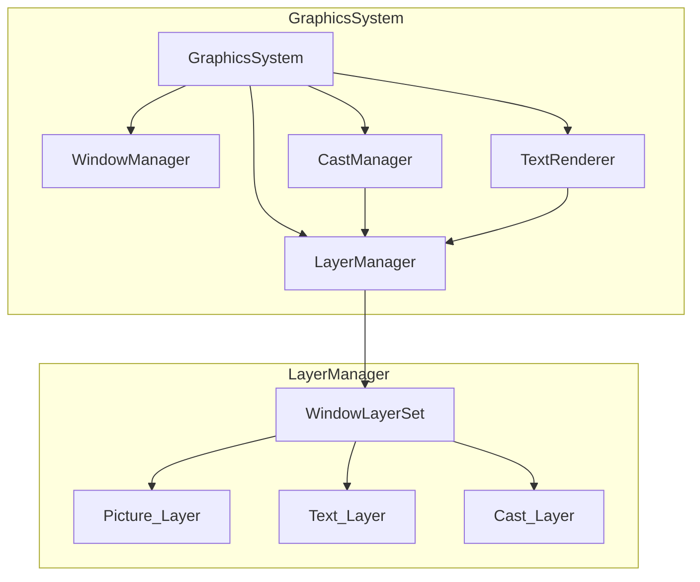

# 設計書: 描画システム (Graphics System)

## 概要

描画システムは、FILLYスクリプトの描画機能を実装します。Ebitengineを使用し、ピクチャー管理、ウィンドウ管理、キャスト管理、テキスト描画、描画プリミティブを提供します。

### 主要機能

1. **ピクチャーシステム**: 画像データの読み込み、生成、転送
2. **ウィンドウシステム**: 仮想ウィンドウの管理
3. **キャストシステム**: スプライトの管理
4. **テキストシステム**: 文字列描画
5. **描画プリミティブ**: 基本図形描画
6. **描画コマンドキュー**: メインスレッド制約への対応

### 設計原則

- **メインスレッド制約**: Ebitengineの描画APIはメインスレッドでのみ呼び出し可能
- **コマンドキュー**: イベントハンドラからの描画はキューイングして実行
- **リソース管理**: 明示的な解放とID再利用
- **エラー耐性**: 致命的でないエラーは記録して継続

## アーキテクチャ

### Ebitengineのメインスレッド制約

**重要**: Ebitengineの描画API（`ebiten.Image`への描画操作）はメインスレッドでのみ呼び出し可能です。VMのイベントハンドラ（mes()ブロック）は別のコンテキストで実行されるため、直接描画APIを呼び出すことはできません。

この制約に対応するため、以下のアーキテクチャを採用します：

```
┌─────────────────────────────────────────────────────────────────┐
│                     メインスレッド (Ebitengine)                   │
│  ┌─────────────┐    ┌─────────────┐    ┌─────────────┐         │
│  │  Update()   │ -> │   Draw()    │ -> │  Layout()   │         │
│  │             │    │             │    │             │         │
│  │ 1. VMイベント│    │ 1. キュー   │    │ スケーリング │         │
│  │    処理     │    │    処理     │    │             │         │
│  │ 2. オーディオ│    │ 2. ウィンドウ│    │             │         │
│  │    更新     │    │    描画     │    │             │         │
│  │ 3. 入力処理 │    │ 3. キャスト │    │             │         │
│  │             │    │    描画     │    │             │         │
│  └─────────────┘    └─────────────┘    └─────────────┘         │
└─────────────────────────────────────────────────────────────────┘
         ↑                    ↑
         │                    │
    コマンド追加          コマンド実行
         │                    │
┌────────┴────────────────────┴───────────────────────────────────┐
│                    描画コマンドキュー                             │
│                   (スレッドセーフ)                               │
│  ┌─────────┐ ┌─────────┐ ┌─────────┐ ┌─────────┐              │
│  │MovePic  │→│PutCast  │→│TextWrite│→│DrawRect │→ ...         │
│  └─────────┘ └─────────┘ └─────────┘ └─────────┘              │
└─────────────────────────────────────────────────────────────────┘
         ↑
         │ Push (どのスレッドからでも可)
         │
┌────────┴────────────────────────────────────────────────────────┐
│                    VMイベントハンドラ                            │
│                   (mes()ブロック)                               │
│                                                                 │
│  mes(MIDI_TIME) {                                               │
│      MovePic(...);  // → キューにPush                           │
│      PutCast(...);  // → キューにPush                           │
│  }                                                              │
└─────────────────────────────────────────────────────────────────┘
```

### 処理フロー

1. **VMイベントハンドラ**が描画関数（MovePic、PutCast等）を呼び出す
2. 描画関数は**実際の描画を行わず**、コマンドをキューにPushする
3. Ebitengineの**Draw()メソッド**（メインスレッド）でキューからコマンドを取り出し実行
4. 実際の`ebiten.Image`への描画はDraw()内でのみ行われる

### システム構成図

```
┌─────────────────────────────────────────────────────────────────┐
│                        Application                               │
│                      (pkg/app/app.go)                           │
└────────────────────────────┬────────────────────────────────────┘
                             │
                             ▼
┌─────────────────────────────────────────────────────────────────┐
│                      Game Loop (Ebitengine)                      │
│                    (pkg/window/window.go)                        │
│  ┌──────────────┐  ┌──────────────┐  ┌──────────────┐          │
│  │   Update()   │  │    Draw()    │  │   Layout()   │          │
│  │  - VM Event  │  │  - Render    │  │  - Scaling   │          │
│  │  - Audio     │  │  - Windows   │  │              │          │
│  │  - Input     │  │  - Casts     │  │              │          │
│  └──────────────┘  └──────────────┘  └──────────────┘          │
└────────────────────────────┬────────────────────────────────────┘
                             │
         ┌───────────────────┼───────────────────┐
         │                   │                   │
         ▼                   ▼                   ▼
┌─────────────────┐  ┌─────────────────┐  ┌─────────────────┐
│  Graphics       │  │  Virtual        │  │  Command        │
│  System         │  │  Machine        │  │  Queue          │
│                 │  │                 │  │                 │
│ ┌─────────────┐ │  │ ┌─────────────┐ │  │ ┌─────────────┐ │
│ │  Picture    │ │  │ │  Event      │ │  │ │  Draw Cmd   │ │
│ │  Manager    │ │  │ │  Dispatcher │ │  │ │  (FIFO)     │ │
│ └─────────────┘ │  │ └─────────────┘ │  │ └─────────────┘ │
│ ┌─────────────┐ │  │ ┌─────────────┐ │  │                 │
│ │  Window     │ │  │ │  Handler    │ │  │                 │
│ │  Manager    │ │  │ │  Registry   │ │  │                 │
│ └─────────────┘ │  │ └─────────────┘ │  │                 │
│ ┌─────────────┐ │  │ ┌─────────────┐ │  │                 │
│ │  Cast       │ │  │ │  Audio      │ │  │                 │
│ │  Manager    │ │  │ │  System     │ │  │                 │
│ └─────────────┘ │  │ └─────────────┘ │  │                 │
│ ┌─────────────┐ │  │                 │  │                 │
│ │  Text       │ │  │                 │  │                 │
│ │  Renderer   │ │  │                 │  │                 │
│ └─────────────┘ │  │                 │  │                 │
└─────────────────┘  └─────────────────┘  └─────────────────┘
```

## コンポーネントとインターフェース

### 1. Graphics System (pkg/graphics/graphics.go)

#### 構造体

```go
// GraphicsSystem は描画システム全体を管理する
type GraphicsSystem struct {
    pictures     *PictureManager
    windows      *WindowManager
    casts        *CastManager
    textRenderer *TextRenderer
    cmdQueue     *CommandQueue
    
    // 仮想デスクトップ
    virtualWidth  int
    virtualHeight int
    
    // 描画状態
    paintColor color.Color
    lineSize   int
    
    // ログ
    log *slog.Logger
    mu  sync.RWMutex
}

func NewGraphicsSystem(opts ...Option) *GraphicsSystem
func (gs *GraphicsSystem) Update()  // ゲームループから呼び出し
func (gs *GraphicsSystem) Draw(screen *ebiten.Image)  // 描画
func (gs *GraphicsSystem) Shutdown()
```

#### Draw関数の実装

Draw関数は以下の順序で描画を行います：

1. **背景色**: `pkg/window/window.go`で既に設定されているため、GraphicsSystemでは塗りつぶさない
2. **ウィンドウ**: Z順序でソートされたウィンドウを順次描画
   - 各ウィンドウに対して`drawWindowDecoration()`を呼び出し
   - ウィンドウ装飾（枠、タイトルバー）とコンテンツを描画
3. **キャスト**: 各ウィンドウに属するキャストを描画

```go
func (gs *GraphicsSystem) Draw(screen *ebiten.Image) {
    gs.mu.RLock()
    defer gs.mu.RUnlock()

    // 背景色は window.go の drawDesktop() で既に設定されている

    // ウィンドウをZ順序で取得
    windows := gs.windows.GetWindowsOrdered()

    // 各ウィンドウを描画
    for _, win := range windows {
        if !win.Visible {
            continue
        }

        // ピクチャーを取得
        pic, err := gs.pictures.GetPic(win.PicID)
        if err != nil {
            continue
        }

        // ウィンドウ装飾を描画（Windows 3.1風）
        gs.drawWindowDecoration(screen, win, pic)

        // キャストを描画
        // ...
    }
}
```

### 2. Picture Manager (pkg/graphics/picture.go)

#### 構造体

```go
// Picture はメモリ上の画像データを表す
type Picture struct {
    ID            int
    Image         *ebiten.Image  // 現在の画像（テキスト描画後）
    OriginalImage *image.RGBA    // 元の背景画像（テキスト描画前）
    Width         int
    Height        int
}
```

**OriginalImageフィールドについて**:
- テキスト描画時のアンチエイリアス影問題を解決するために追加
- LoadPic/CreatePic時に元の画像をRGBAとして保存
- TextWriteでは、このOriginalImageを基準に差分を取ることで、同じ位置に別の色でテキストを描画しても前のテキストの影が残らない

// PictureManager はピクチャーを管理する
type PictureManager struct {
    pictures map[int]*Picture
    nextID   int
    maxID    int  // 最大256
    basePath string  // 画像ファイルの基準パス
    mu       sync.RWMutex
}

func NewPictureManager(basePath string) *PictureManager
func (pm *PictureManager) LoadPic(filename string) (int, error)
func (pm *PictureManager) CreatePic(width, height int) (int, error)
func (pm *PictureManager) CreatePicFrom(srcID, width, height int) (int, error)
func (pm *PictureManager) DelPic(id int) error
func (pm *PictureManager) GetPic(id int) (*Picture, error)
func (pm *PictureManager) PicWidth(id int) int
func (pm *PictureManager) PicHeight(id int) int
```

#### ファイル検索

ファイル検索は既存の `pkg/fileutil/fileutil.go` を使用します。大文字小文字非依存の検索機能が実装済みです。

```go
// LoadPicでのファイル検索
func (pm *PictureManager) LoadPic(filename string) (int, error) {
    // fileutil.FindFileを使用して大文字小文字非依存で検索
    fullPath, err := fileutil.FindFile(pm.basePath, filename)
    if err != nil {
        return -1, fmt.Errorf("file not found: %s", filename)
    }
    // ...
}
```

#### RLE圧縮BMPデコーダー (pkg/graphics/bmp.go)

Go標準ライブラリの`image/bmp`はRLE圧縮をサポートしていないため、カスタムデコーダーを実装しています。

**サポートする圧縮方式**:
- BI_RGB (0): 非圧縮
- BI_RLE8 (1): 8ビットRLE圧縮
- BI_RLE4 (2): 4ビットRLE圧縮

**RLE8デコードアルゴリズム**:
```
2バイトペアを読み取る:
- 最初のバイトが0でない場合: 2番目のバイトを最初のバイト回繰り返す
- 最初のバイトが0の場合:
  - 2番目のバイトが0: 行末 (End of Line)
  - 2番目のバイトが1: ビットマップ終了 (End of Bitmap)
  - 2番目のバイトが2: デルタ（位置移動）
  - それ以外: 絶対モード（2番目のバイト個のピクセルをそのまま読み取る）
```

**RLE4デコードアルゴリズム**:
RLE8と同様だが、1バイトに2ピクセル（上位4ビットと下位4ビット）が格納される。

**LoadPicでの使用**:
```go
func (pm *PictureManager) LoadPic(filename string) (int, error) {
    // BMPファイルの場合、RLE圧縮かどうかを確認
    if isBMPFile(fullPath) {
        isRLE, err := IsBMPRLECompressed(file)
        if isRLE {
            // RLE圧縮BMPの場合、カスタムデコーダーを使用
            img, err = DecodeBMP(file)
        } else {
            // 非圧縮BMPの場合、標準デコーダーを使用
            img, _, err = image.Decode(file)
        }
    }
    // ...
}
```

### 3. Picture Transfer (pkg/graphics/transfer.go)

#### 転送関数

```go
// MovePic はピクチャー間で画像を転送する
// mode: 0=通常, 1=透明色除外, 2-9=シーンチェンジ
func (gs *GraphicsSystem) MovePic(
    srcID, srcX, srcY, width, height int,
    dstID, dstX, dstY int,
    mode int, speed int,
) error

// MoveSPic は拡大縮小して転送する
func (gs *GraphicsSystem) MoveSPic(
    srcID, srcX, srcY, srcW, srcH int,
    dstID, dstX, dstY, dstW, dstH int,
) error

// TransPic は指定した透明色を除いて転送する
func (gs *GraphicsSystem) TransPic(
    srcID, srcX, srcY, width, height int,
    dstID, dstX, dstY int,
    transColor color.Color,
) error

// ReversePic は左右反転して転送する
func (gs *GraphicsSystem) ReversePic(
    srcID, srcX, srcY, width, height int,
    dstID, dstX, dstY int,
) error
```

#### シーンチェンジ実装

```go
// SceneChangeMode はシーンチェンジのモードを表す
type SceneChangeMode int

const (
    SceneChangeNone       SceneChangeMode = 0  // 通常コピー
    SceneChangeTransparent SceneChangeMode = 1  // 透明色除外
    SceneChangeWipeDown   SceneChangeMode = 2  // 上から下
    SceneChangeWipeRight  SceneChangeMode = 3  // 左から右
    SceneChangeWipeLeft   SceneChangeMode = 4  // 右から左
    SceneChangeWipeUp     SceneChangeMode = 5  // 下から上
    SceneChangeWipeOut    SceneChangeMode = 6  // 中央から外側
    SceneChangeWipeIn     SceneChangeMode = 7  // 外側から中央
    SceneChangeRandom     SceneChangeMode = 8  // ランダムブロック
    SceneChangeFade       SceneChangeMode = 9  // フェード
)

// SceneChange はシーンチェンジを管理する
type SceneChange struct {
    srcPic    *Picture
    dstPic    *Picture
    srcRect   image.Rectangle
    dstPoint  image.Point
    mode      SceneChangeMode
    speed     int
    progress  float64  // 0.0 - 1.0
    completed bool
}

func (sc *SceneChange) Update() bool  // 完了したらtrue
func (sc *SceneChange) Apply()        // 現在の進捗を適用
```

### 4. Window Manager (pkg/graphics/window.go)

#### 構造体

```go
// Window は仮想ウィンドウを表す
type Window struct {
    ID       int
    PicID    int           // 関連付けられたピクチャー
    X, Y     int           // 仮想デスクトップ上の位置
    Width    int           // 表示幅
    Height   int           // 表示高さ
    PicX     int           // ピクチャー内の参照X
    PicY     int           // ピクチャー内の参照Y
    BgColor  color.Color   // 背景色
    Caption  string        // キャプション
    Visible  bool
    ZOrder   int           // Z順序（大きいほど前面）
    Casts    []int         // このウィンドウに属するキャストID
}

// WindowManager はウィンドウを管理する
type WindowManager struct {
    windows    map[int]*Window
    nextID     int
    maxID      int  // 最大64
    nextZOrder int
    mu         sync.RWMutex
}

func NewWindowManager() *WindowManager
func (wm *WindowManager) OpenWin(picID int, opts ...WinOption) (int, error)
func (wm *WindowManager) MoveWin(id int, opts ...WinOption) error
func (wm *WindowManager) CloseWin(id int) error
func (wm *WindowManager) CloseWinAll()
func (wm *WindowManager) GetWin(id int) (*Window, error)
func (wm *WindowManager) GetWindowsOrdered() []*Window  // Z順序でソート
```

#### ウィンドウオプション

```go
type WinOption func(*Window)

func WithPosition(x, y int) WinOption
func WithSize(width, height int) WinOption
func WithPicOffset(picX, picY int) WinOption
func WithBgColor(c color.Color) WinOption
func WithPicID(picID int) WinOption
```

#### ウィンドウ装飾

仮想ウィンドウはWindows 3.1風の装飾で描画されます：

```go
const (
    BorderThickness = 4  // 外枠の幅
    TitleBarHeight  = 20 // タイトルバーの高さ
)

// ウィンドウ装飾の色
var (
    titleBarColor  = color.RGBA{0, 0, 128, 255}     // 濃い青
    borderColor    = color.RGBA{192, 192, 192, 255} // グレー
    highlightColor = color.RGBA{255, 255, 255, 255} // 白（立体効果のハイライト）
    shadowColor    = color.RGBA{0, 0, 0, 255}       // 黒（立体効果の影）
)
```

**装飾の構成**:
1. **外枠**: グレーの背景に3D効果（上と左に白いハイライト、下と右に黒い影）
2. **タイトルバー**: 濃い青（#000080）の矩形、高さ20ピクセル
3. **コンテンツ領域**: ピクチャーが表示される領域

**座標計算**:
- ウィンドウ全体のサイズ = コンテンツ幅 + BorderThickness × 2
- ウィンドウ全体の高さ = コンテンツ高さ + BorderThickness × 2 + TitleBarHeight
- コンテンツ領域の開始位置 = (win.X + BorderThickness, win.Y + BorderThickness + TitleBarHeight)

**描画順序**:
1. グレーの背景を全体に描画
2. 3D枠線効果を描画（vector.StrokeLineを使用）
3. タイトルバーを描画
4. コンテンツ領域にピクチャーを描画

**実装参考**: `_old_implementation2/pkg/engine/renderer.go`のrenderWindow関数

### 5. Cast Manager (pkg/graphics/cast.go)

#### 概要

キャストはスプライト（動くキャラクター）として機能します。`PutCast`で配置し、`MoveCast`で位置やソース領域を更新します。キャストは毎フレーム`drawCastsForWindow`で描画され、背景画像に焼き付けられることはありません。

#### 動作原理

1. **PutCast**: キャストを作成し、ウィンドウに配置
2. **MoveCast**: キャストの位置/ソース領域を更新（描画は行わない）
3. **描画**: 毎フレーム`Draw()`内で`drawCastsForWindow()`が呼ばれ、すべての可視キャストが描画される
4. **DelCast**: キャストを削除

この設計により、キャストを移動してもアニメーションが正しく表示され、残像が発生しません。

#### 構造体

```go
// Cast はスプライトを表す
type Cast struct {
    ID       int
    WinID    int           // 所属するウィンドウ
    PicID    int           // ソースピクチャー
    X, Y     int           // ウィンドウ内の位置
    SrcX     int           // ピクチャー内のソースX
    SrcY     int           // ピクチャー内のソースY
    Width    int           // 幅
    Height   int           // 高さ
    Visible  bool
    ZOrder   int           // Z順序
}

// CastManager はキャストを管理する
type CastManager struct {
    casts   map[int]*Cast
    nextID  int
    maxID   int  // 最大1024
    mu      sync.RWMutex
}

func NewCastManager() *CastManager
func (cm *CastManager) PutCast(winID, picID, x, y, srcX, srcY, w, h int) (int, error)
func (cm *CastManager) MoveCast(id int, opts ...CastOption) error
func (cm *CastManager) DelCast(id int) error
func (cm *CastManager) GetCast(id int) (*Cast, error)
func (cm *CastManager) GetCastsByWindow(winID int) []*Cast
func (cm *CastManager) DeleteCastsByWindow(winID int)
```

### 6. Text Renderer (pkg/graphics/text.go)

#### 構造体

```go
// FontSettings はフォント設定を保持する
type FontSettings struct {
    Name      string
    Size      int
    Weight    int
    Italic    bool
    Underline bool
    Strikeout bool
}

// TextSettings はテキスト描画設定を保持する
type TextSettings struct {
    TextColor color.Color
    BgColor   color.Color
    BackMode  int  // 0=透明, 1=不透明
}

// TextRenderer はテキスト描画を管理する
type TextRenderer struct {
    font     *FontSettings
    settings *TextSettings
    face     text.Face
    mu       sync.RWMutex
}

func NewTextRenderer() *TextRenderer
func (tr *TextRenderer) SetFont(name string, size int, opts ...FontOption) error
func (tr *TextRenderer) SetTextColor(c color.Color)
func (tr *TextRenderer) SetBgColor(c color.Color)
func (tr *TextRenderer) SetBackMode(mode int)
func (tr *TextRenderer) TextWrite(pic *Picture, x, y int, text string) error
```

#### レイヤー方式によるテキスト描画（アンチエイリアス影問題の解決）

FILLYスクリプトでは、同じ位置に異なる色でテキストを描画することがあります（例：黒で描画後、白で上書き）。
通常のアルファブレンディングでは、前のテキストのアンチエイリアス部分が「影」として残ってしまいます。

この問題を解決するため、レイヤー方式を採用しています：

```
┌─────────────────────────────────────────────────────────────────┐
│                    レイヤー方式の処理フロー                       │
├─────────────────────────────────────────────────────────────────┤
│                                                                 │
│  1. 元の背景画像（OriginalImage）を取得                          │
│     ┌─────────────┐                                             │
│     │ 背景画像    │  ← LoadPic時に保存されたオリジナル           │
│     │ (文字なし)  │                                             │
│     └─────────────┘                                             │
│                                                                 │
│  2. 背景のコピーにテキストを描画                                  │
│     ┌─────────────┐                                             │
│     │ 背景 + 文字 │  ← アルファブレンディングで描画              │
│     │ (黒い文字)  │                                             │
│     └─────────────┘                                             │
│                                                                 │
│  3. 背景との差分を取り、文字部分だけを抽出                        │
│     ┌─────────────┐                                             │
│     │ 透明背景    │  ← 色が変わった部分 = 文字                   │
│     │ + 文字のみ  │     色が同じ部分 = 透明                      │
│     └─────────────┘                                             │
│                                                                 │
│  4. 抽出したレイヤーを元の背景に合成                              │
│     ┌─────────────┐                                             │
│     │ 最終画像    │  ← draw.Over でアルファブレンディング        │
│     │             │                                             │
│     └─────────────┘                                             │
│                                                                 │
└─────────────────────────────────────────────────────────────────┘
```

**重要なポイント**:
- 毎回「元の背景画像（OriginalImage）」を基準に差分を取る
- これにより、同じ位置に別の色で描画しても、前のテキストの影が残らない
- 後から描画したテキストが完全に前のテキストを上書きする

**実装（pkg/graphics/text_layer.go）**:

```go
// TextLayer はテキスト描画のレイヤーを表す
type TextLayer struct {
    Image  *image.RGBA // 透明背景 + 文字
    PicID  int         // 描画先のピクチャーID
    X, Y   int         // ピクチャー内の描画位置
    Width  int         // レイヤーの幅
    Height int         // レイヤーの高さ
}

// CreateTextLayer はテキストレイヤーを作成する
// 背景に文字を描画し、差分を取って文字部分だけを透明背景で抽出する
func CreateTextLayer(
    background *image.RGBA,  // 元の背景画像（OriginalImage）
    face font.Face,
    text string,
    x, y int,
    fontSize int,
    textColor color.Color,
    picID int,
) *TextLayer
```

**パフォーマンス**:
- ベンチマーク結果: レイヤー作成 ~66μs、10レイヤー合成 ~50μs
- 60fps（16.7ms/フレーム）で十分な余裕がある

#### アンチエイリアス無効化

オリジナルのFILLYと同じ見た目を再現するため、テキスト描画時にアンチエイリアス（スムージング）を無効にします。

```go
// TextWriteではアンチエイリアスを無効にして描画
func (tr *TextRenderer) TextWrite(pic *Picture, x, y int, text string) error {
    // Ebitengineのtext.Drawはデフォルトでアンチエイリアスが有効
    // ビットマップフォントを使用するか、描画後に二値化処理を行う
    
    // 方法1: ビットマップフォントを使用
    // 方法2: 描画後にピクセルを二値化（閾値処理）
    // 方法3: opentype.FaceOptions で Hinting を設定
}
```

#### 日本語フォント対応

FILLYスクリプトではWindows用フォント（MSゴシック、MS明朝等）が指定されますが、macOSやLinuxには存在しないため、フォールバック機能を実装します。

```go
// フォントマッピング（Windows → クロスプラットフォーム）
var fontMapping = map[string][]string{
    "ＭＳ ゴシック":   {"Hiragino Kaku Gothic Pro", "Noto Sans JP", "IPAGothic"},
    "ＭＳ Ｐゴシック": {"Hiragino Kaku Gothic Pro", "Noto Sans JP", "IPAGothic"},
    "ＭＳ 明朝":       {"Hiragino Mincho Pro", "Noto Serif JP", "IPAMincho"},
    "ＭＳ Ｐ明朝":     {"Hiragino Mincho Pro", "Noto Serif JP", "IPAMincho"},
    "ms gothic":       {"Hiragino Kaku Gothic Pro", "Noto Sans JP", "IPAGothic"},
    "ms mincho":       {"Hiragino Mincho Pro", "Noto Serif JP", "IPAMincho"},
}

// loadFont はフォントを読み込む
func (tr *TextRenderer) loadFont(name string, size int) (text.Face, error) {
    // 1. フォントマッピングでフォールバック候補を取得
    candidates := []string{name}
    if mapped, ok := fontMapping[strings.ToLower(name)]; ok {
        candidates = append(candidates, mapped...)
    }
    
    // 2. システムフォントを順番に検索
    for _, fontName := range candidates {
        if face, err := tr.loadSystemFont(fontName, size); err == nil {
            return face, nil
        }
    }
    
    // 3. 埋め込みフォントを使用（フォールバック）
    return tr.loadEmbeddedFont(size)
}

// システムフォントのパス（OS別）
func getSystemFontPaths() []string {
    switch runtime.GOOS {
    case "darwin":
        return []string{
            "/System/Library/Fonts",
            "/Library/Fonts",
            os.ExpandEnv("$HOME/Library/Fonts"),
        }
    case "linux":
        return []string{
            "/usr/share/fonts",
            "/usr/local/share/fonts",
            os.ExpandEnv("$HOME/.fonts"),
        }
    case "windows":
        return []string{
            os.ExpandEnv("$WINDIR/Fonts"),
        }
    default:
        return nil
    }
}

// 埋め込みフォント（日本語対応）
//go:embed fonts/NotoSansJP-Regular.ttf
var defaultFontData []byte
```

### 7. Command Queue (pkg/graphics/queue.go)

#### 構造体

```go
// CommandType は描画コマンドの種類を表す
type CommandType int

const (
    CmdMovePic CommandType = iota
    CmdMoveSPic
    CmdTransPic
    CmdReversePic
    CmdOpenWin
    CmdMoveWin
    CmdCloseWin
    CmdPutCast
    CmdMoveCast
    CmdDelCast
    CmdTextWrite
    CmdDrawLine
    CmdDrawRect
    CmdFillRect
    CmdDrawCircle
)

// Command は描画コマンドを表す
type Command struct {
    Type CommandType
    Args []any
}

// CommandQueue はスレッドセーフな描画コマンドキュー
type CommandQueue struct {
    commands []Command
    mu       sync.Mutex
}

func NewCommandQueue() *CommandQueue
func (cq *CommandQueue) Push(cmd Command)
func (cq *CommandQueue) PopAll() []Command
func (cq *CommandQueue) Len() int
```

### 8. Drawing Primitives (pkg/graphics/primitives.go)

#### 描画関数

```go
// DrawLine は直線を描画する
func (gs *GraphicsSystem) DrawLine(picID, x1, y1, x2, y2 int) error

// DrawRect は矩形を描画する
func (gs *GraphicsSystem) DrawRect(picID, x1, y1, x2, y2, fillMode int) error

// FillRect は矩形を塗りつぶす
func (gs *GraphicsSystem) FillRect(picID, x1, y1, x2, y2 int, c color.Color) error

// DrawCircle は円を描画する
func (gs *GraphicsSystem) DrawCircle(picID, x, y, radius, fillMode int) error

// SetLineSize は線の太さを設定する
func (gs *GraphicsSystem) SetLineSize(size int)

// SetPaintColor は描画色を設定する
func (gs *GraphicsSystem) SetPaintColor(c color.Color)

// GetColor は指定座標のピクセル色を取得する
func (gs *GraphicsSystem) GetColor(picID, x, y int) (color.Color, error)
```

## データモデル

### 色の表現

```go
// FILLYの色形式（0xRRGGBB）をcolor.Colorに変換
func ColorFromInt(c int) color.Color {
    return color.RGBA{
        R: uint8((c >> 16) & 0xFF),
        G: uint8((c >> 8) & 0xFF),
        B: uint8(c & 0xFF),
        A: 0xFF,
    }
}

// color.ColorをFILLYの色形式に変換
func ColorToInt(c color.Color) int {
    r, g, b, _ := c.RGBA()
    return int(r>>8)<<16 | int(g>>8)<<8 | int(b>>8)
}

// 透明色（黒）
var TransparentColor = color.RGBA{0, 0, 0, 0xFF}
```

### 座標系

```go
// 仮想デスクトップ座標（1024x768）
// 左上が(0, 0)、右下が(1023, 767)

// 実際のウィンドウ座標への変換
func (gs *GraphicsSystem) VirtualToScreen(vx, vy int, screenW, screenH int) (int, int) {
    scaleX := float64(screenW) / float64(gs.virtualWidth)
    scaleY := float64(screenH) / float64(gs.virtualHeight)
    scale := min(scaleX, scaleY)
    
    offsetX := (float64(screenW) - float64(gs.virtualWidth)*scale) / 2
    offsetY := (float64(screenH) - float64(gs.virtualHeight)*scale) / 2
    
    return int(float64(vx)*scale + offsetX), int(float64(vy)*scale + offsetY)
}

// スクリーン座標から仮想デスクトップ座標への変換
func (gs *GraphicsSystem) ScreenToVirtual(sx, sy int, screenW, screenH int) (int, int) {
    // 逆変換
}
```

## 正確性プロパティ

### ピクチャーシステムのプロパティ

**プロパティ1: ピクチャーIDの一意性**
*任意の*2つのピクチャーについて、それらのIDは異なる
**検証: 要件 1.2**

**プロパティ2: ピクチャーサイズの正確性**
*任意の*ピクチャーについて、PicWidth/PicHeightは実際の画像サイズと一致する
**検証: 要件 1.7, 1.8**

**プロパティ3: ピクチャー削除後のアクセス**
*任意の*削除されたピクチャーIDについて、アクセス時にエラーが返される
**検証: 要件 1.9**

### ウィンドウシステムのプロパティ

**プロパティ4: ウィンドウZ順序**
*任意の*2つのウィンドウについて、後から開いたウィンドウのZOrderは大きい
**検証: 要件 3.11**

**プロパティ5: ウィンドウ削除時のキャスト削除**
*任意の*ウィンドウについて、CloseWin後にそのウィンドウに属するキャストは存在しない
**検証: 要件 9.2**

### キャストシステムのプロパティ

**プロパティ6: キャストIDの一意性**
*任意の*2つのキャストについて、それらのIDは異なる
**検証: 要件 4.2**

**プロパティ7: キャスト位置の更新**
*任意の*キャストについて、MoveCast後の位置は指定された値と一致する
**検証: 要件 4.3**

### コマンドキューのプロパティ

**プロパティ8: コマンド実行順序**
*任意の*コマンド列について、実行順序はキューへの追加順序と一致する
**検証: 要件 7.4**

**プロパティ9: スレッドセーフ性**
*任意の*並行アクセスについて、データ競合が発生しない
**検証: 要件 7.1**

### リソース管理のプロパティ

**プロパティ10: リソース制限**
*任意の*時点で、ピクチャー数は256以下、ウィンドウ数は64以下、キャスト数は1024以下
**検証: 要件 9.5, 9.6, 9.7**

## エラーハンドリング

### エラーの分類

#### 致命的エラー
- グラフィックスシステムの初期化失敗
- Ebitengineの初期化失敗

#### 非致命的エラー
- ファイルが見つからない
- 無効なピクチャーID
- 無効なウィンドウID
- 無効なキャストID
- リソース制限超過

### エラーログフォーマット

```
[timestamp] [level] [component] function_name: message (args)
```

例:
```
[19:43:20.577] [ERROR] [Graphics] LoadPic: file not found (filename=image.bmp)
[19:43:20.578] [WARN] [Graphics] MovePic: invalid picture ID (srcID=999)
```

## テスト戦略

### ユニットテスト

- PictureManager: 読み込み、生成、削除、サイズ取得
- WindowManager: 開く、移動、閉じる、Z順序
- CastManager: 配置、移動、削除
- TextRenderer: フォント設定、描画
- CommandQueue: Push、PopAll、並行アクセス

### プロパティベーステスト

- プロパティ1-10（上記参照）
- テストライブラリ: gopter

### 統合テスト

- サンプルスクリプトの実行
- 描画結果のスクリーンショット比較（将来）

## 実装の優先順位

### フェーズ1: 基盤
1. GraphicsSystem構造体
2. PictureManager（LoadPic、CreatePic、DelPic）
3. CommandQueue

### フェーズ2: ウィンドウとキャスト
1. WindowManager（OpenWin、MoveWin、CloseWin）
2. CastManager（PutCast、MoveCast、DelCast）
3. 描画ループ統合

### フェーズ3: ピクチャー転送
1. MovePic（mode=0, 1）
2. TransPic、ReversePic
3. MoveSPic

### フェーズ4: テキストと図形
1. TextRenderer（SetFont、TextWrite）
2. 描画プリミティブ（DrawLine、DrawRect、FillRect）

### フェーズ5: シーンチェンジ
1. MovePic（mode=2-9）
2. アニメーション制御

### フェーズ6: VM統合
1. 組み込み関数の実装
2. ヘッドレスモード対応
3. ゲームループ統合

## 技術的な考慮事項

### 並行性

- CommandQueueはsync.Mutexで保護
- PictureManager、WindowManager、CastManagerはsync.RWMutexで保護
- Ebitengineの描画APIはDraw()内でのみ呼び出し

### パフォーマンス

- ピクチャー転送はEbitengineのDrawImage()を使用（GPU加速）
- 変更のないウィンドウは再描画をスキップ
- キャストはバッチ描画で最適化

### メモリ管理

- ピクチャー削除時にebiten.Imageを解放
- ウィンドウ削除時に関連キャストを削除
- シャットダウン時にすべてのリソースを解放

## 依存関係

### 外部ライブラリ

- **github.com/hajimehoshi/ebiten/v2**: 描画エンジン
- **github.com/hajimehoshi/ebiten/v2/vector**: ベクター描画（ウィンドウ装飾用）
- **github.com/hajimehoshi/ebiten/v2/text/v2**: テキスト描画
- **golang.org/x/image/font**: フォント処理
- **golang.org/x/image/bmp**: BMP読み込み

### 内部パッケージ

- **pkg/vm**: 仮想マシン（組み込み関数登録）
- **pkg/logger**: ログ出力
- **pkg/window**: 既存のウィンドウスケルトン

## パッケージ構成

```
pkg/graphics/
├── graphics.go      # GraphicsSystem
├── picture.go       # PictureManager
├── bmp.go           # RLE圧縮BMPデコーダー
├── transfer.go      # ピクチャー転送
├── window.go        # WindowManager
├── cast.go          # CastManager
├── text.go          # TextRenderer
├── text_layer.go    # テキストレイヤー（アンチエイリアス影問題対策）
├── primitives.go    # 描画プリミティブ
├── queue.go         # CommandQueue
├── color.go         # 色変換ユーティリティ
├── scene_change.go  # シーンチェンジ
├── debug.go         # デバッグオーバーレイ
└── fonts/
    └── NotoSansJP-Regular.ttf  # 埋め込みフォント
```

## デバッグオーバーレイ

### 概要

デバッグ時に描画要素のIDを画面上に表示することで、問題の特定を容易にします。ログレベルがDebug（レベル2）以上の場合にのみ表示されます。

### 表示内容

```
┌─────────────────────────────────────────────────────────────────┐
│  ウィンドウ (タイトルバー)                              [W1]    │
├─────────────────────────────────────────────────────────────────┤
│  ┌─────────┐                                                    │
│  │ P1      │  ← ピクチャーID（緑色、半透明黒背景）              │
│  │         │                                                    │
│  │  ┌────────────┐                                              │
│  │  │ C1(P2)     │  ← キャストID（黄色、半透明黒背景）          │
│  │  │            │     C1=キャストID、P2=ソースピクチャーID     │
│  │  └────────────┘                                              │
│  └─────────┘                                                    │
└─────────────────────────────────────────────────────────────────┘
```

### 実装

```go
// DebugOverlay はデバッグ情報の描画を管理する
type DebugOverlay struct {
    enabled bool
    font    text.Face
}

// DrawWindowID はウィンドウIDをタイトルバーに描画する
func (do *DebugOverlay) DrawWindowID(screen *ebiten.Image, win *Window) {
    if !do.enabled {
        return
    }
    label := fmt.Sprintf("[W%d]", win.ID)
    // タイトルバーの右側に黄色で描画
    // ...
}

// DrawPictureID はピクチャーIDをウィンドウ内容の左上に描画する
func (do *DebugOverlay) DrawPictureID(screen *ebiten.Image, picID int, x, y int) {
    if !do.enabled {
        return
    }
    label := fmt.Sprintf("P%d", picID)
    // 半透明黒背景 + 緑色テキスト
    // ...
}

// DrawCastID はキャストIDをキャスト位置に描画する
func (do *DebugOverlay) DrawCastID(screen *ebiten.Image, cast *Cast, x, y int) {
    if !do.enabled {
        return
    }
    label := fmt.Sprintf("C%d(P%d)", cast.ID, cast.PicID)
    // 半透明黒背景 + 黄色テキスト
    // ...
}
```

### 色の定義

```go
var (
    debugWindowIDColor  = color.RGBA{255, 255, 0, 255}   // 黄色
    debugPictureIDColor = color.RGBA{0, 255, 0, 255}     // 緑色
    debugCastIDColor    = color.RGBA{255, 255, 0, 255}   // 黄色
    debugBgColor        = color.RGBA{0, 0, 0, 200}       // 半透明黒
)
```


---

## ~~レイヤーシステム再設計 (Layer System Redesign)~~ [廃止]

> **注意**: このセクションの設計は、スプライトシステムに置き換えられました。
> レイヤーシステムは実装されましたが、その後スプライトシステムに移行したため、現在は使用されていません。
> 以下の設計は歴史的な参照のために残されていますが、現在の実装には適用されません。
> 
> **現在の実装**: `GetLayerManager()`はnilを返し、すべての描画はスプライトシステム経由で行われます。

<details>
<summary>廃止された設計（クリックで展開）</summary>

### 概要

このセクションは、グラフィックスレイヤーシステムの再設計を定義します。現在の実装では、レイヤーがPictureIDで管理されていますが、FILLYの設計ではレイヤーはWindowに属するべきです。この再設計により、レイヤーの所属関係を正しく管理し、描画の不具合を解消します。

### 現在の問題点

```
現在の実装:
┌─────────────────────────────────────────────────────────────┐
│ LayerManager                                                 │
│   layers: map[PictureID]*PictureLayerSet                    │
│                                                              │
│   createCastLayer: cast.WinID で登録 ← 正しい               │
│   drawLayersForWindow: win.PicID で検索 ← 間違い            │
└─────────────────────────────────────────────────────────────┘
```

この不一致により、レイヤーが見つからないか、間違ったウィンドウに関連付けられます。

### 新しい設計

```
新しい実装:
┌─────────────────────────────────────────────────────────────┐
│ LayerManager                                                 │
│   windowLayers: map[WindowID]*WindowLayerSet                │
│                                                              │
│   createCastLayer: winID で登録                             │
│   drawLayersForWindow: win.ID で検索                        │
└─────────────────────────────────────────────────────────────┘
```

### レイヤーモデル

```
Window
├── Background Color (fill)
└── Layer Stack (Z-order)
    ├── Picture_Layer (MovePicで作成、焼き付け可能)
    ├── Text_Layer (TextWriteで作成、常に新規)
    └── Cast_Layer (PutCastで作成、スプライト動作)
```

### コンポーネント図



### WindowLayerSet（新規）

`PictureLayerSet`を置き換える新しい構造体。ウィンドウIDをキーとして管理します。

```go
// WindowLayerSet はウィンドウに属するレイヤーの集合
type WindowLayerSet struct {
    // ウィンドウID
    WinID int
    
    // 背景色
    BgColor color.Color
    
    // ウィンドウサイズ
    Width, Height int
    
    // レイヤースタック（Z順序でソート）
    Layers []Layer
    
    // 次のZ順序カウンター
    nextZOrder int
    
    // 合成バッファ
    CompositeBuffer *ebiten.Image
    
    // ダーティフラグ
    FullDirty bool
    DirtyRegion image.Rectangle
}
```

### LayerManager（変更）

```go
// LayerManager はレイヤーを管理する
type LayerManager struct {
    // ウィンドウIDごとのレイヤーセット（新規）
    windowLayers map[int]*WindowLayerSet
    
    // ピクチャーIDごとのレイヤー（後方互換性のために残す）
    layers map[int]*PictureLayerSet
    
    // 次のレイヤーID
    nextLayerID int
    
    // ミューテックス
    mu sync.RWMutex
}
```

**注意: picToWinMappingについて**

設計当初は`picToWinMapping`（ピクチャーIDからウィンドウIDへのマッピング）をLayerManagerに追加することを検討していましたが、以下の理由から不要と判断しました：

1. **WindowManagerが既に逆引き機能を提供**: `WindowManager.GetWinByPicID()`が実装済みで、ピクチャーIDからウィンドウIDへの逆引きが可能
2. **データの一貫性**: 同じマッピングを複数の場所で管理すると、データの同期が必要になり複雑さが増す
3. **実際の使用パターン**: `transfer.go`、`vm.go`などで`GetWinByPicID`が使用されており、正常に動作している

要件29.5「ピクチャーIDからウィンドウIDへの逆引きをサポートする」は、WindowManagerの`GetWinByPicID`メソッドで満たされています。

### Picture_Layer（新規）

MovePicで作成されるレイヤー。焼き付け（baking）が可能です。

```go
// PictureLayer はMovePicで作成されるレイヤー
type PictureLayer struct {
    BaseLayer
    
    // ウィンドウサイズの透明画像
    image *ebiten.Image
    
    // 焼き付け可能フラグ
    bakeable bool
}

// Bake は画像をこのレイヤーに焼き付ける
func (l *PictureLayer) Bake(src *ebiten.Image, destX, destY int)

// IsBakeable は焼き付け可能かどうかを返す
func (l *PictureLayer) IsBakeable() bool
```

### Text_Layer（変更）

TextWriteで作成されるレイヤー。常に新規作成されます。

```go
// TextLayerEntry はテキストレイヤーのエントリ
// 既存の実装を維持しつつ、WindowLayerSetに追加
type TextLayerEntry struct {
    BaseLayer
    textLayer *TextLayer
}
```

### Cast_Layer（変更）

PutCastで作成されるスプライトレイヤー。

```go
// CastLayer はキャストを保持するレイヤー
// 既存の実装を維持しつつ、WindowLayerSetに追加
type CastLayer struct {
    BaseLayer
    // ... 既存のフィールド
}
```

### Layer インターフェース（変更）

```go
// Layer は描画レイヤーの基本インターフェース
type Layer interface {
    GetID() int
    GetBounds() image.Rectangle
    GetZOrder() int
    SetZOrder(int)
    IsVisible() bool
    IsOpaque() bool
    IsDirty() bool
    SetDirty(bool)
    GetImage() *ebiten.Image
    Invalidate()
    
    // 新規: レイヤータイプを識別
    GetLayerType() LayerType
}

// LayerType はレイヤーの種類を表す
type LayerType int

const (
    LayerTypePicture LayerType = iota
    LayerTypeText
    LayerTypeCast
)
```

### レイヤー所属関係

```
┌─────────────────────────────────────────────────────────────┐
│ Window (ID: 0)                                               │
│   ├── BgColor: RGB(0, 0, 128)                               │
│   └── Layers:                                                │
│       ├── Picture_Layer (Z=1) ← MovePic結果                 │
│       ├── Cast_Layer (Z=2) ← PutCast結果                    │
│       ├── Picture_Layer (Z=3) ← MovePic結果（新規作成）     │
│       └── Text_Layer (Z=4) ← TextWrite結果                  │
└─────────────────────────────────────────────────────────────┘

┌─────────────────────────────────────────────────────────────┐
│ Window (ID: 1)                                               │
│   ├── BgColor: RGB(255, 255, 255)                           │
│   └── Layers:                                                │
│       ├── Cast_Layer (Z=1)                                   │
│       └── Text_Layer (Z=2)                                   │
└─────────────────────────────────────────────────────────────┘
```

### MovePicの焼き付けロジック

```
MovePic呼び出し時:
┌─────────────────────────────────────────────────────────────┐
│ 1. 最上位レイヤーを確認                                      │
│                                                              │
│ 2. IF 最上位がPicture_Layer:                                │
│       → そのレイヤーに焼き付け                              │
│                                                              │
│ 3. ELSE IF 最上位がCast/Text_Layer:                         │
│       → 新しいPicture_Layer（ウィンドウサイズ、透明）を作成 │
│       → 新しいレイヤーに焼き付け                            │
│                                                              │
│ 4. ELSE (レイヤースタックが空):                             │
│       → 新しいPicture_Layerを作成                           │
│       → 新しいレイヤーに焼き付け                            │
└─────────────────────────────────────────────────────────────┘
```

### レイヤーシステムの正しさの性質

*正しさの性質とは、システムのすべての有効な実行において真であるべき特性や振る舞いです。*

#### Property 11: レイヤーのWindowID管理

*任意の*ウィンドウIDとレイヤーに対して、そのウィンドウIDでレイヤーを登録した場合、同じウィンドウIDで検索するとそのレイヤーが見つかる。

**検証: 要件 24.1, 24.5**

#### Property 12: ウィンドウ開閉時のレイヤーセット管理

*任意の*ウィンドウに対して、ウィンドウを開いた後はWindowLayerSetが存在し、ウィンドウを閉じた後はそのウィンドウに属するすべてのレイヤーが削除される。

**検証: 要件 24.2, 24.3**

#### Property 13: レイヤータイプの識別

*任意の*レイヤーに対して、GetLayerType()は正しいレイヤータイプ（Picture、Text、Cast）を返す。

**検証: 要件 25.4**

#### Property 14: MovePicの焼き付けロジック

*任意の*ウィンドウとMovePic呼び出しに対して:
- 最上位がPicture_Layerの場合、レイヤー数は増えない
- 最上位がCast/Text_Layerまたはスタックが空の場合、新しいPicture_Layerが作成される
- 新しいPicture_Layerはウィンドウサイズで透明に初期化される
- 焼き付け後、対象レイヤーはダーティとしてマークされる

**検証: 要件 26.2, 26.3, 26.4, 26.5, 26.6**

#### Property 15: Text_Layerの新規作成

*任意の*TextWrite呼び出しに対して、常に新しいText_Layerが作成され、既存のレイヤーは再利用されない。

**検証: 要件 25.6, 28.1, 28.2**

#### Property 16: Cast_Layerのスプライト動作

*任意の*Cast_Layerに対して:
- PutCastで新しいCast_Layerが作成される
- MoveCastで位置が更新される（Z順序は変わらない）
- DelCastでCast_Layerが削除される
- 移動時に古い位置と新しい位置がダーティ領域としてマークされる

**検証: 要件 27.1, 27.2, 27.3, 27.6**

#### Property 17: Z順序の管理

*任意の*レイヤー追加操作に対して:
- 新しいレイヤーには現在のZ順序カウンターが割り当てられる
- カウンターは操作ごとに増加する
- すべてのレイヤータイプで共通のカウンターが使用される
- レイヤーはZ順序（小さい順）でソートされる

**検証: 要件 23.1, 23.2, 23.5**

#### Property 18: レイヤーのウィンドウ登録

*任意の*レイヤー作成操作（PutCast、MovePic、TextWrite）に対して:
- レイヤーは正しいウィンドウIDで登録される
- ピクチャーIDからウィンドウIDへの逆引きが正しく動作する

**検証: 要件 29.1, 29.2, 29.3, 29.5**

#### Property 19: ダーティフラグの動作

*任意の*レイヤー変更操作に対して:
- 位置変更時にダーティフラグが設定される
- 内容変更時にダーティフラグが設定される
- 合成処理完了後にダーティフラグがクリアされる

**検証: 要件 31.1, 31.2**

#### Property 20: エラーハンドリング

*任意の*無効なID（存在しないウィンドウID、レイヤーID）に対して:
- エラーがログに記録される
- 処理がスキップされる（クラッシュしない）
- 実行が継続される

**検証: 要件 32.1, 32.2, 32.3, 32.4**

### レイヤーシステムのエラーハンドリング

| エラー | 処理 |
|--------|------|
| 存在しないウィンドウID | ログに記録し、処理をスキップ |
| 存在しないレイヤーID | ログに記録し、処理をスキップ |
| レイヤー作成失敗 | ログに記録し、nilを返す |
| ピクチャーID逆引き失敗 | ログに記録し、処理をスキップ |

### エラーメッセージ形式

```
[関数名]: [エラー内容], windowID=[ID], layerID=[ID]
```

例:
```
drawLayersForWindow: window layer set not found, windowID=5
createCastLayer: failed to create layer, windowID=3, castID=10
```

### レイヤーシステムのテスト戦略

#### 単体テスト

1. **WindowLayerSetの作成と削除**
   - ウィンドウを開いた後、WindowLayerSetが存在することを確認
   - ウィンドウを閉じた後、WindowLayerSetが削除されることを確認

2. **レイヤータイプの識別**
   - 各レイヤータイプがGetLayerType()で正しく識別されることを確認

3. **焼き付けロジックのエッジケース**
   - 空のスタックでのMovePic
   - Picture_Layerが最上位でのMovePic
   - Cast_Layerが最上位でのMovePic

4. **エラーハンドリング**
   - 存在しないウィンドウIDでの操作
   - 存在しないレイヤーIDでの操作

#### プロパティベーステスト

**テストライブラリ**: `testing/quick` または `github.com/leanovate/gopter`

**設定**: 各プロパティテストは最低100回の反復を実行

1. **Property 11: レイヤーのWindowID管理**
   - ランダムなウィンドウIDとレイヤーを生成
   - 登録と検索が一致することを確認
   - **Tag**: Feature: layer-system-redesign, Property 11: レイヤーのWindowID管理

2. **Property 12: ウィンドウ開閉時のレイヤーセット管理**
   - ランダムなウィンドウ操作シーケンスを生成
   - 開閉後の状態が正しいことを確認
   - **Tag**: Feature: layer-system-redesign, Property 12: ウィンドウ開閉時のレイヤーセット管理

3. **Property 14: MovePicの焼き付けロジック**
   - ランダムな初期状態とMovePic呼び出しを生成
   - 焼き付けロジックが正しく動作することを確認
   - **Tag**: Feature: layer-system-redesign, Property 14: MovePicの焼き付けロジック

4. **Property 17: Z順序の管理**
   - ランダムなレイヤー追加シーケンスを生成
   - Z順序が正しく増加することを確認
   - **Tag**: Feature: layer-system-redesign, Property 17: Z順序の管理

5. **Property 18: レイヤーのウィンドウ登録**
   - ランダムなレイヤー作成操作を生成
   - 正しいウィンドウに登録されることを確認
   - **Tag**: Feature: layer-system-redesign, Property 18: レイヤーのウィンドウ登録

#### 統合テスト

1. **既存スクリプトの動作確認**
   - サンプルFILLYタイトルを実行し、描画結果を確認
   - 回帰がないことを確認

2. **複合操作のテスト**
   - MovePic → PutCast → TextWrite の順序で操作
   - 正しいZ順序で描画されることを確認

</details>

---

## スプライトシステム (Sprite System)

### 概要

このセクションは、グラフィックスシステムを簡素化するためのスプライトシステムの設計を定義します。すべての描画要素を統一的なスプライトとして扱い、Ebitengineの機能をラップします。

### 全体構成

```
┌─────────────────────────────────────────────────────────────┐
│ SpriteManager                                                │
│   sprites: map[int]*Sprite                                  │
│   sorted: []*Sprite (Z順序キャッシュ)                       │
├─────────────────────────────────────────────────────────────┤
│ Sprite                                                       │
│   - ID, Image, X, Y, ZOrder, Visible, Alpha, Parent, Dirty  │
└─────────────────────────────────────────────────────────────┘
```

### 描画要素とスプライトの対応

| 描画要素 | スプライトとしての実装 |
|----------|------------------------|
| 仮想ウインドウ | 背景色で塗りつぶしたスプライト（子の親となる） |
| ピクチャ | BMPを読み込んだスプライト |
| キャスト | 透明色処理済みのスプライト |
| 文字 | 差分抽出で生成した透過スプライト |
| 図形 | 描画結果をスプライト化 |

### Sprite構造体

```go
type Sprite struct {
    id       int            // 一意のID
    image    *ebiten.Image  // 描画画像
    x, y     float64        // 位置（親からの相対位置）
    localZ   int            // ローカルZ順序（兄弟間での順序）
    visible  bool           // 可視性
    alpha    float64        // 透明度（0.0〜1.0）
    parent   *Sprite        // 親スプライト（オプション）
    children []*Sprite      // 子スプライトのリスト
    dirty    bool           // 再描画フラグ
}
```

### SpriteManager構造体

```go
type SpriteManager struct {
    mu        sync.RWMutex
    sprites   map[int]*Sprite  // ID→スプライト
    roots     []*Sprite        // ルートスプライト（親を持たない）
    nextID    int              // 次のID
    needSort  bool             // ソート必要フラグ
}
```

### 親子関係の処理

#### 絶対位置の計算

```go
func (s *Sprite) AbsolutePosition() (float64, float64) {
    x, y := s.x, s.y
    if s.parent != nil {
        px, py := s.parent.AbsolutePosition()
        x += px
        y += py
    }
    return x, y
}
```

#### 実効透明度の計算

```go
func (s *Sprite) EffectiveAlpha() float64 {
    alpha := s.alpha
    if s.parent != nil {
        alpha *= s.parent.EffectiveAlpha()
    }
    return alpha
}
```

#### 実効可視性の計算

```go
func (s *Sprite) IsEffectivelyVisible() bool {
    if !s.visible {
        return false
    }
    if s.parent != nil {
        return s.parent.IsEffectivelyVisible()
    }
    return true
}
```

### ウインドウ内スプライトの親子関係管理

ウインドウ内のスプライト（キャスト、テキスト、ピクチャ、図形）は、WindowSpriteを親として設定される。
これにより、以下の利点がある：

1. **位置計算の自動化**: 子スプライトの位置はウインドウ相対座標で指定でき、絶対位置は親子関係から自動計算される
2. **可視性の継承**: ウインドウが非表示になると、子スプライトも自動的に非表示になる
3. **透明度の継承**: ウインドウの透明度が子スプライトにも適用される
4. **一括削除**: ウインドウが閉じられると、子スプライトも自動的に削除される
5. **描画順序の継承**: 子スプライトは親の後に描画され、前面のウインドウが背面のウインドウを隠す

#### n次元の親子階層

親子関係は任意の深さをサポートする。例えば：

```
Root (SpriteManager)
├── Window0 (localZ=0)
│   ├── Background (localZ=0)
│   ├── PictureSprite1 (localZ=1)
│   │   └── CastSprite1 (localZ=0)  ← ピクチャの子としてキャスト
│   ├── CastSprite2 (localZ=2)
│   └── TextSprite1 (localZ=3)
└── Window1 (localZ=1)  ← Window0より前面
    ├── Background (localZ=0)
    └── TextSprite2 (localZ=1)
```

#### 子スプライトの管理

Spriteは子スプライトのリストを管理し、以下のメソッドを提供する：

```go
// 子スプライトを追加（ローカルZ順序は自動割り当て）
func (s *Sprite) AddChild(child *Sprite)

// 子スプライトを削除
func (s *Sprite) RemoveChild(childID int)

// 子スプライトのリストを取得（ローカルZ順序でソート済み）
func (s *Sprite) GetChildren() []*Sprite

// 次のローカルZ順序を取得
func (s *Sprite) GetNextLocalZ() int
```

### 階層的Z順序（Hierarchical Z-Order）

#### 概要

スプライトシステムでは、Z順序を階層的（n次元）に管理する。
各スプライトは「ローカルZ順序」を持ち、これは同じ親を持つ兄弟スプライト間での描画順序を決定する。
描画は深さ優先で行われ、親スプライトの後にその子スプライトがローカルZ順序で描画される。

#### ローカルZ順序

各スプライトは`localZ`フィールドを持ち、これは同じ親を持つ兄弟間での順序を表す。
子スプライトが追加されるたびに、親は次のローカルZ順序を割り当てる。

```go
func (s *Sprite) AddChild(child *Sprite) {
    child.parent = s
    child.localZ = s.nextLocalZ
    s.nextLocalZ++
    s.children = append(s.children, child)
    s.sortChildren()
}
```

#### 描画アルゴリズム

描画は深さ優先で行われる：

```go
func (sm *SpriteManager) Draw(screen *ebiten.Image) {
    // ルートスプライトをローカルZ順序でソート
    sm.sortRoots()
    
    // 各ルートスプライトを再帰的に描画
    for _, root := range sm.roots {
        sm.drawSpriteRecursive(screen, root)
    }
}

func (sm *SpriteManager) drawSpriteRecursive(screen *ebiten.Image, s *Sprite) {
    if !s.IsEffectivelyVisible() {
        return
    }
    
    // 1. 自分自身を描画
    if s.image != nil {
        op := &ebiten.DrawImageOptions{}
        x, y := s.AbsolutePosition()
        op.GeoM.Translate(x, y)
        
        alpha := s.EffectiveAlpha()
        if alpha < 1.0 {
            op.ColorScale.ScaleAlpha(float32(alpha))
        }
        
        screen.DrawImage(s.image, op)
    }
    
    // 2. 子スプライトをローカルZ順序で描画
    for _, child := range s.children {
        sm.drawSpriteRecursive(screen, child)
    }
}
```

### 描画順序の例

```
Root
├── Window0 (localZ=0)
│   ├── Background (localZ=0)
│   ├── Cast1 (localZ=1)
│   ├── Text1 (localZ=2)
│   └── MovePic1 (localZ=3)
└── Window1 (localZ=1)
    ├── Background (localZ=0)
    └── Cast2 (localZ=1)
```

描画順序：
1. Window0
2. Window0/Background
3. Window0/Cast1
4. Window0/Text1
5. Window0/MovePic1
6. Window1
7. Window1/Background
8. Window1/Cast2

この順序により、Window1の内容はWindow0の内容を完全に隠す（正しい動作）。

### テキストスプライト（差分抽出方式）

#### 処理フロー

```
1. 背景色で塗りつぶした一時画像を作成
2. 一時画像にテキストを描画（アンチエイリアスあり）
3. 背景色と異なるピクセルのみを抽出
4. 抽出結果を透過画像としてスプライト化
```

#### 実装

```go
func CreateTextSprite(bg color.Color, text string, textColor color.Color, face font.Face) *image.RGBA {
    // 1. 背景画像を作成
    bgImg := image.NewRGBA(bounds)
    draw.Draw(bgImg, bgImg.Bounds(), image.NewUniform(bg), image.Point{}, draw.Src)
    
    // 2. テキストを描画
    tempImg := image.NewRGBA(bounds)
    draw.Draw(tempImg, tempImg.Bounds(), bgImg, image.Point{}, draw.Src)
    drawer := &font.Drawer{Dst: tempImg, Src: image.NewUniform(textColor), Face: face}
    drawer.DrawString(text)
    
    // 3. 差分を抽出
    result := image.NewRGBA(bounds)
    for y := 0; y < height; y++ {
        for x := 0; x < width; x++ {
            if bgImg.At(x, y) != tempImg.At(x, y) {
                result.Set(x, y, tempImg.At(x, y))
            } else {
                result.Set(x, y, color.RGBA{0, 0, 0, 0}) // 透明
            }
        }
    }
    return result
}
```

#### 背景ブレンド描画

TextSpriteは差分抽出方式で作成されるため、背景色を基準にしている。
しかし、実際の背景はMovePicで転送された画像であることが多い。
そのため、TextSpriteを描画する際に、下のスプライト（PictureSpriteなど）の
画像を参照して、正しくアンチエイリアシングをブレンドする必要がある。

### スプライトシステムの正しさの性質

#### Property 21: スプライトID管理

*任意の*スプライト作成に対して、作成されたスプライトは一意のIDを持ち、そのIDで取得できる。

**検証: 要件 33.1, 35.1, 35.3**

#### Property 22: 親子関係の位置計算

*任意の*親子関係を持つスプライトに対して、子の絶対位置は親の位置と子の相対位置の和である。

**検証: 要件 34.1**

#### Property 23: 親子関係の透明度計算

*任意の*親子関係を持つスプライトに対して、子の実効透明度は親の透明度と子の透明度の積である。

**検証: 要件 34.2**

#### Property 24: 親子関係の可視性

*任意の*親子関係を持つスプライトに対して、親が非表示なら子も非表示として扱われる。

**検証: 要件 34.3, 36.3**

#### Property 25: 階層的Z順序による描画順

*任意の*スプライト階層に対して、描画は以下の順序で行われる：
1. ルートスプライトはローカルZ順序（小さい順）で描画される
2. 各スプライトの後に、その子スプライトがローカルZ順序で再帰的に描画される

**検証: 要件 36.1, 36.2**

#### Property 26: 子スプライトのローカルZ順序割り当て

*任意の*子スプライト追加に対して、追加された順序でローカルZ順序が割り当てられる。

**検証: 要件 34.7**

#### Property 27: テキスト差分抽出

*任意の*テキスト描画に対して、差分抽出後の画像は背景色のピクセルを含まない（透明になる）。

**検証: 要件 37.1, 37.2**

#### Property 28: スプライト削除

*任意の*スプライト削除に対して、削除後はそのIDでスプライトを取得できない。

**検証: 要件 35.4**

#### Property 29: 親子階層の深さ

*任意の*親子関係の設定に対して、階層の深さに制限がない。

**検証: 要件 34.8**

#### Property 30: ウインドウ間の重なり

*任意の*複数ウインドウに対して、後から開かれたウインドウ（ローカルZ順序が大きい）の内容は、先に開かれたウインドウの内容を隠す。

**検証: 要件 36.6**

### スプライトシステムのエラーハンドリング

| エラー | 処理 |
|--------|------|
| 存在しないIDでの取得 | nilを返す |
| 存在しないIDでの削除 | 何もしない |
| nil画像でのスプライト作成 | 許可（後で画像を設定可能） |

### スプライトシステム完全統合

#### 概要

現在の実装では、MovePicなどの操作がピクチャー画像に直接描画（焼き付け）を行い、
追加でPictureSpriteも作成するという二重管理になっている。
これを解消し、すべての描画をスプライトシステム経由で行うように変更する。

#### 現在の問題点

1. **二重管理**: MovePicはピクチャー画像に直接描画し、さらにPictureSpriteも作成
2. **描画の不整合**: ピクチャー画像への焼き付けとスプライト描画が混在
3. **Z順序の問題**: スプライトのZ順序が正しく反映されない場合がある

#### 解決方針

1. **ピクチャーへの直接描画を廃止**: MovePicはPictureSpriteのみを作成
2. **スプライトベースの描画**: すべての描画はスプライトシステム経由で行う
3. **ピクチャースプライトの融合**: 同じ位置に重なるピクチャースプライトは融合

### ピクチャースプライトの融合

#### 概要

MovePicで同じピクチャーに複数回描画する場合、個別のスプライトを作成すると
スプライト数が増大し、パフォーマンスが低下する。
同じ位置に重なるピクチャースプライトは、一つのスプライトに融合することで
効率的な描画を実現する。

#### 融合の条件

以下の条件をすべて満たす場合、ピクチャースプライトを融合する：

1. 同じ転送先ピクチャーID（dstID）を持つ
2. 同じZ順序を持つ（または近いZ順序）
3. 領域が重なっている、または隣接している

#### 融合の実装

```go
// PictureSpriteManagerに融合機能を追加
func (psm *PictureSpriteManager) MergeOrCreatePictureSprite(
    srcImg *ebiten.Image,
    picID int,
    srcX, srcY, width, height int,
    destX, destY int,
    zOrder int,
    transparent bool,
) *PictureSprite {
    // 既存のPictureSpriteで融合可能なものを検索
    existing := psm.FindMergeableSprite(picID, destX, destY, width, height, zOrder)
    
    if existing != nil {
        // 既存のスプライトに画像を合成
        existing.MergeImage(srcImg, destX, destY, transparent)
        return existing
    }
    
    // 新しいPictureSpriteを作成
    return psm.CreatePictureSprite(srcImg, picID, srcX, srcY, width, height, destX, destY, zOrder, transparent)
}
```

#### 融合の利点

1. **スプライト数の削減**: 同じ領域への複数回の描画が1つのスプライトに集約
2. **パフォーマンス向上**: 描画するスプライト数が減少
3. **メモリ効率**: 重複する画像データを削減

### 完全統合の試行結果と課題（2026-01-28）

完全統合を試行したところ、以下の問題が発生した：

1. **表示位置のずれ**: スプライトの位置とオフセット（PicX/PicY）が二重に適用される
2. **テキストのぼやけ**: アンチエイリアシングの問題
3. **文字化けしたテキスト**: OpenWin前に作成されたテキストが正しく表示されない

これらの問題は、以下の原因によるものと考えられる：

- **座標系の不整合**: ピクチャー座標系とスクリーン座標系の変換が複雑
- **描画順序の問題**: ウィンドウ装飾とコンテンツの描画順序
- **オフセット処理の重複**: PicX/PicYオフセットが複数箇所で適用される

**現在の方針**: 
- 完全統合は一旦保留し、現在の「二重管理」状態を維持
- ピクチャーへの直接描画（焼き付け）を継続
- スプライトシステムは補助的な役割として使用
- 将来的に、座標系の整理とオフセット処理の統一を行った上で再度統合を試みる

### スプライトシステムのテスト戦略

#### 単体テスト

- スプライトの作成と属性設定
- 親子関係の位置・透明度・可視性計算
- SpriteManagerのCRUD操作
- 子スプライトの追加とローカルZ順序の自動割り当て
- 階層的描画順序の検証
- ピクチャースプライトの融合

#### プロパティベーステスト

- Property 21〜30の検証
- ランダムな親子関係での位置計算
- ランダムな階層構造での描画順序
- n次元の親子階層での正しい描画
- ピクチャースプライト融合の正確性

#### 統合テスト

- 複数ウインドウの重なりテスト
- ウインドウ内の操作順序による描画順序テスト
- ピクチャの子としてキャストを配置するテスト
