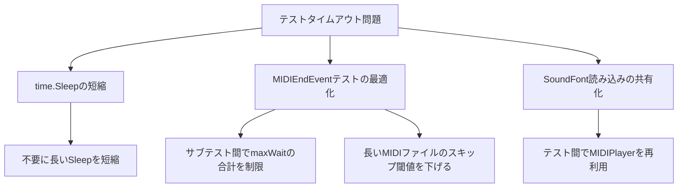

# 設計書

## 概要

`pkg/vm/audio/midi_test.go` のテストスイートが `go test -timeout 30s` でタイムアウトする問題を修正する。根本原因の分析に基づき、テストの実行時間を短縮する。

## 根本原因分析

### 時間消費の内訳

テストファイル内の主な時間消費源:

1. **SoundFont読み込み**: `NewMIDIPlayer` が呼ばれるたびにSoundFontファイル（数MB）を読み込み、シンセサイザーを初期化する。テストファイル内で約15回呼ばれている。
2. **MIDI再生完了待ちループ**: `TestMIDIPlayerMIDIEndEvent` の3つのサブテストが各々 `duration + 2s` まで待機する。MIDIファイルの長さによっては各サブテストで数秒〜数十秒かかる。
3. **累積 `time.Sleep`**: 各テストの `time.Sleep` が合計で約2秒以上。
4. **オーディオプレイヤー作成**: `Play()` のたびに `audioCtx.NewPlayer()` を呼び、Ebitengineのオーディオプレイヤーを作成する。

### 最大の問題

`TestMIDIPlayerMIDIEndEvent` が最大の時間消費源。3つのサブテストが各々MIDI再生完了を待つポーリングループを持ち、`maxWait > 30s` の場合のみスキップする。しかし、MIDIファイルの長さが10秒程度でも、3サブテスト × (10s + 2s) = 36秒となり、これだけで30秒を超える。

## アーキテクチャ

修正は `pkg/vm/audio/midi_test.go` のテストコードのみに対して行う。プロダクションコードの変更は不要。

### 修正方針



## コンポーネントとインターフェース

### 変更対象

`pkg/vm/audio/midi_test.go` のみ。

### 修正内容

#### 1. `TestMIDIPlayerMIDIEndEvent` のタイムアウト制御

現状: `maxWait > 30*time.Second` の場合のみスキップ。3サブテストの合計が30秒を超える可能性がある。

修正: スキップ閾値を `5*time.Second` に下げる。MIDIファイルの再生時間が5秒を超える場合、再生完了を待つテストをスキップする。

```go
// 修正前
maxWait := duration + 2*time.Second
if maxWait > 30*time.Second {
    t.Skip("MIDI file too long for completion test")
}

// 修正後
const midiEndTestMaxDuration = 5 * time.Second
if duration > midiEndTestMaxDuration {
    t.Skip("MIDI file too long for completion test")
}
maxWait := duration + 2*time.Second
```

#### 2. `time.Sleep` の短縮

テスト内の `time.Sleep` を必要最小限に短縮する。オーディオレンダリングの確認には50ms程度で十分。

| 現在の値 | 修正後 | 対象テスト |
|---------|--------|-----------|
| 200ms | 100ms | TestMIDIPlayerUpdate (generates events) |
| 300ms | 150ms | TestMIDIPlayerUpdate (sequential ticks) |
| 200ms | 100ms | TestMIDIPlayerUpdate (starts from tick 1) |
| 200ms | 100ms | TestMIDIPlayerExclusiveControl (new MIDI resets tick) × 2箇所 |

100ms以下の `time.Sleep` はそのまま維持する（これ以上短縮するとテストが不安定になるリスクがある）。

#### 3. ポーリングループの最適化

`TestMIDIPlayerMIDIEndEvent` のポーリング間隔を50msから20msに短縮し、応答性を向上させる。

## データモデル

変更なし（テストコードのみの修正）。


## 正確性プロパティ

*プロパティとは、システムの全ての有効な実行において成立すべき特性や振る舞いのことである。プロパティは人間が読める仕様と機械的に検証可能な正確性保証の橋渡しとなる。*

### プリワーク分析結果

本修正はテストコード自体の変更であり、プロダクションコードの変更を伴わない。受け入れ基準の分析の結果、プロパティベーステストの対象となる普遍的なプロパティは存在しない。

検証は以下の方法で行う:
- 修正後に `go test ./pkg/vm/audio/... -timeout 30s` を実行し、全テストがパスすること
- テストの検証ロジック（アサーション）が変更されていないことをコードレビューで確認

## エラーハンドリング

テストコードの修正のため、新たなエラーハンドリングは不要。既存テストのエラーハンドリング（`t.Fatalf`, `t.Errorf`, `t.Skip`）はそのまま維持する。

`time.Sleep` の短縮により、オーディオレンダリングが間に合わずテストが不安定になるリスクがある。100ms未満への短縮は行わず、不安定になった場合は値を調整する。

## テスト戦略

### 検証方法

1. **修正前の確認**: `go test ./pkg/vm/audio/... -timeout 30s -v` を実行し、タイムアウトが発生することを確認
2. **修正後の確認**: 同じコマンドを実行し、全テストが30秒以内にパスすることを確認
3. **個別テストの確認**: `go test ./pkg/vm/audio/... -timeout 30s -run TestMIDIPlayerGetCurrentTick -v` で対象テストが正常にパスすることを確認
4. **回帰テスト**: テストの検証ロジック（アサーション文）が変更されていないことを確認

### プロパティベーステスト

本修正ではプロパティベーステストは不要。テストコード自体の修正であり、テスト対象のプロダクションコードに変更がないため。
