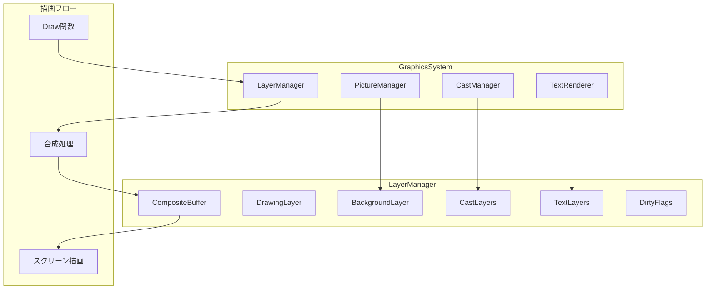
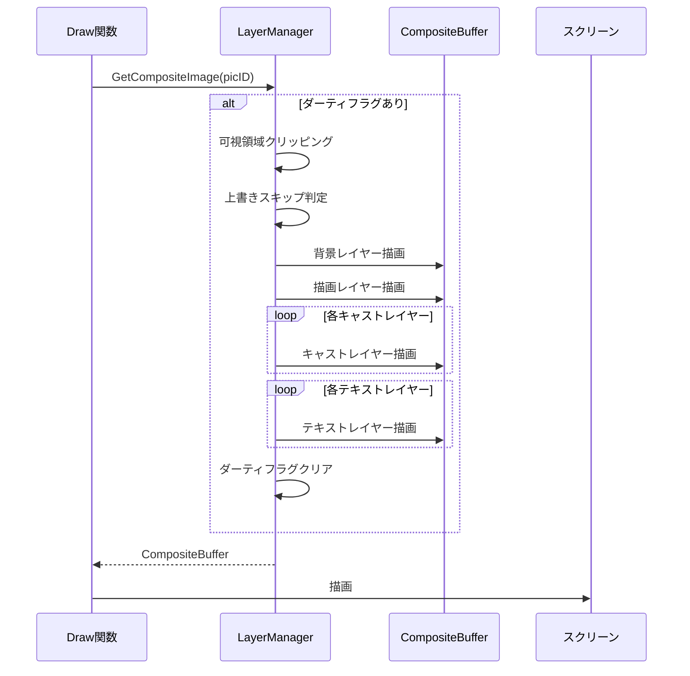

# 設計ドキュメント: レイヤーベース描画システム

## 概要

レイヤーベース描画システムは、FILLYの描画処理を改善するための機能です。すべての描画要素（背景、キャスト、描画、テキスト）をレイヤーとして管理し、**操作順序に基づくZ順序**で合成します。

現在の問題:
- キャストがスクリーンに直接描画されており、MovePicで描画された内容がキャストの下に隠れる
- _old_implementation2では「焼き付け」方式だったが、現在の実装では異なる動作をしている

解決策:
- レイヤーマネージャーを導入し、すべての描画要素をレイヤーとして管理
- **操作順序に基づくZ順序**で合成することで、_old_implementation2と同等の描画結果を実現
- 後から実行された操作（MovePic、PutCast、TextWrite）が前面に表示される
- パフォーマンス最適化（ダーティフラグ、キャッシュ、クリッピング）を適用

## Z順序管理の原則

**重要**: FILLYでは、描画操作の実行順序がZ順序を決定します。

```
操作順序の例:
1. MovePic → DrawingEntry (Z=1)  ← 最背面
2. PutCast → CastLayer (Z=2)
3. TextWrite → TextLayerEntry (Z=3)
4. MovePic → DrawingEntry (Z=4)  ← Castの上に表示
5. PutCast → CastLayer (Z=5)     ← 最前面
```

すべての描画操作（MovePic、PutCast、TextWrite）は同じZ順序カウンターを共有し、操作のたびにカウンターが増加します。これにより、後から実行された操作が前面に表示されます。

## アーキテクチャ



## コンポーネントとインターフェース

### Layer インターフェース

```go
// Layer は描画レイヤーの基本インターフェース
type Layer interface {
    // GetID はレイヤーIDを返す
    GetID() int
    
    // GetBounds はレイヤーの境界ボックスを返す
    GetBounds() image.Rectangle
    
    // GetZOrder はZ順序を返す
    GetZOrder() int
    
    // IsVisible は可視性を返す
    IsVisible() bool
    
    // IsDirty はダーティフラグを返す
    IsDirty() bool
    
    // SetDirty はダーティフラグを設定する
    SetDirty(dirty bool)
    
    // GetImage はレイヤーの画像を返す（キャッシュがあればキャッシュを返す）
    GetImage() *ebiten.Image
    
    // Invalidate はキャッシュを無効化する
    Invalidate()
}
```

### LayerManager 構造体

```go
// LayerManager はレイヤーを管理する
type LayerManager struct {
    // ピクチャーIDごとのレイヤー
    layers map[int]*PictureLayerSet
    
    // 次のレイヤーID
    nextLayerID int
    
    // ミューテックス
    mu sync.RWMutex
}

// PictureLayerSet はピクチャーに属するレイヤーのセット
type PictureLayerSet struct {
    // ピクチャーID
    PicID int
    
    // 背景レイヤー（常にZ=0、最背面）
    Background *BackgroundLayer
    
    // すべてのレイヤー（操作順序でソート）
    // DrawingEntry、CastLayer、TextLayerEntryを含む
    Layers []Layer
    
    // 次のZ順序カウンター（すべての操作で共有）
    nextZOrder int
    
    // 合成バッファ
    CompositeBuffer *ebiten.Image
    
    // ダーティ領域
    DirtyRegion image.Rectangle
    
    // 全体がダーティかどうか
    FullDirty bool
}
```

### BackgroundLayer 構造体

```go
// BackgroundLayer は背景レイヤー
type BackgroundLayer struct {
    id      int
    picID   int
    image   *ebiten.Image
    bounds  image.Rectangle
    visible bool
    dirty   bool
    zOrder  int // 常に0（最背面）
}
```

### DrawingEntry 構造体

```go
// DrawingEntry はMovePicで描画された内容を保持するエントリ
// 各MovePic呼び出しで新しいDrawingEntryが作成される
type DrawingEntry struct {
    id      int
    picID   int
    image   *ebiten.Image  // 描画内容
    bounds  image.Rectangle
    visible bool
    dirty   bool
    zOrder  int // 常に1（背景の上、キャストの下）
}
```

### CastLayer 構造体

```go
// CastLayer はキャストを保持するレイヤー
type CastLayer struct {
    id            int
    castID        int
    picID         int
    srcPicID      int
    x, y          int
    srcX, srcY    int
    width, height int
    transColor    color.Color
    hasTransColor bool
    image         *ebiten.Image // キャッシュされた画像（透明色処理済み）
    bounds        image.Rectangle
    visible       bool
    dirty         bool
    zOrder        int
}
```

### TextLayerEntry 構造体

```go
// TextLayerEntry はテキストレイヤーのエントリ
type TextLayerEntry struct {
    id      int
    picID   int
    x, y    int
    text    string
    image   *ebiten.Image // キャッシュされた画像
    bounds  image.Rectangle
    visible bool
    dirty   bool
    zOrder  int
}
```

## データモデル

### レイヤーの階層構造

```
Picture (PicID)
├── BackgroundLayer (ZOrder: 0)
│   └── OriginalImage
├── DrawingLayer (ZOrder: 1)
│   └── MovePicで描画された内容
├── CastLayers (ZOrder: 100+)
│   ├── CastLayer 1 (ZOrder: 100)
│   ├── CastLayer 2 (ZOrder: 101)
│   └── ...
└── TextLayers (ZOrder: 1000+)
    ├── TextLayer 1 (ZOrder: 1000)
    ├── TextLayer 2 (ZOrder: 1001)
    └── ...
```

### Z順序の割り当て

| レイヤータイプ | Z順序範囲 | 説明 |
|--------------|----------|------|
| Background   | 0        | 背景画像（常に最背面） |
| Drawing      | 1        | MovePicで描画された内容 |
| Cast         | 100-999  | キャスト（作成順に割り当て） |
| Text         | 1000+    | テキスト（作成順に割り当て） |


## 合成処理フロー



## 最適化戦略

### 1. ダーティフラグ

各レイヤーにダーティフラグを持たせ、変更があった場合のみ再描画します。

```go
// レイヤーの変更を追跡
func (l *CastLayer) SetPosition(x, y int) {
    if l.x != x || l.y != y {
        l.x = x
        l.y = y
        l.dirty = true
        l.bounds = image.Rect(x, y, x+l.width, y+l.height)
    }
}
```

### 2. 可視領域クリッピング

ウィンドウの可視領域外にあるレイヤーは描画をスキップします。

```go
// 可視領域との交差判定
func (lm *LayerManager) isLayerVisible(layer Layer, visibleRect image.Rectangle) bool {
    return !layer.GetBounds().Intersect(visibleRect).Empty()
}
```

### 3. レイヤーキャッシュ

特にテキストレイヤーは作成コストが高いため、キャッシュを重視します。

```go
// キャッシュされた画像を取得
func (l *TextLayerEntry) GetImage() *ebiten.Image {
    if l.image == nil || l.dirty {
        l.image = l.renderText()
        l.dirty = false
    }
    return l.image
}
```

### 4. 部分更新

変更があった領域のみを再合成します。

```go
// ダーティ領域を追跡
func (pls *PictureLayerSet) AddDirtyRegion(rect image.Rectangle) {
    if pls.DirtyRegion.Empty() {
        pls.DirtyRegion = rect
    } else {
        pls.DirtyRegion = pls.DirtyRegion.Union(rect)
    }
}
```

### 5. 上書きスキップ

完全に覆われたレイヤーの描画をスキップします。

```go
// 上書きスキップ判定
func (lm *LayerManager) shouldSkipLayer(layer Layer, upperLayers []Layer) bool {
    for _, upper := range upperLayers {
        if upper.IsVisible() && upper.IsOpaque() && 
           upper.GetBounds().Contains(layer.GetBounds().Min) &&
           upper.GetBounds().Contains(layer.GetBounds().Max) {
            return true
        }
    }
    return false
}
```

## _old_implementation2との互換性

### PutCastの動作

_old_implementation2では、PutCastはキャストをbase_picに「焼き付ける」動作をしていました。新しい実装では、レイヤーとして管理しつつ、同等の描画結果を実現します。

```go
// PutCastの実装
func (lm *LayerManager) PutCast(destPicID, srcPicID, x, y, srcX, srcY, w, h int, transColor color.Color) int {
    // 1. CastLayerを作成
    castLayer := &CastLayer{
        id:            lm.nextLayerID,
        picID:         destPicID,
        srcPicID:      srcPicID,
        x:             x,
        y:             y,
        srcX:          srcX,
        srcY:          srcY,
        width:         w,
        height:        h,
        transColor:    transColor,
        hasTransColor: transColor != nil,
        visible:       true,
        dirty:         true,
        zOrder:        100 + len(lm.layers[destPicID].Casts),
    }
    
    // 2. 透明色処理済みの画像をキャッシュ
    castLayer.image = lm.createTransparentImage(srcPicID, srcX, srcY, w, h, transColor)
    
    // 3. レイヤーを追加
    lm.layers[destPicID].Casts = append(lm.layers[destPicID].Casts, castLayer)
    lm.layers[destPicID].FullDirty = true
    
    lm.nextLayerID++
    return castLayer.id
}
```

### MoveCastの動作

_old_implementation2では、MoveCastはダブルバッファリングを使用してキャストの残像を防いでいました。新しい実装では、レイヤーの位置を更新するだけで、合成時に正しい結果が得られます。

```go
// MoveCastの実装
func (lm *LayerManager) MoveCast(castID, x, y int) error {
    // 1. キャストレイヤーを検索
    castLayer := lm.findCastLayer(castID)
    if castLayer == nil {
        return fmt.Errorf("cast not found: %d", castID)
    }
    
    // 2. 古い位置をダーティ領域に追加
    lm.layers[castLayer.picID].AddDirtyRegion(castLayer.bounds)
    
    // 3. 位置を更新
    castLayer.SetPosition(x, y)
    
    // 4. 新しい位置をダーティ領域に追加
    lm.layers[castLayer.picID].AddDirtyRegion(castLayer.bounds)
    
    return nil
}
```


## 正確性プロパティ

*プロパティとは、システムのすべての有効な実行において真であるべき特性または動作です。プロパティは、人間が読める仕様と機械で検証可能な正確性保証の橋渡しをします。*

### Property 1: レイヤー管理の一貫性

*任意の*レイヤーマネージャーに対して、背景レイヤー、描画レイヤー、キャストレイヤー、テキストレイヤーを追加した場合、それらは正しいZ順序（背景 < 描画 < キャスト < テキスト）で管理される。

**Validates: Requirements 1.1, 1.2, 1.3, 1.4, 1.5, 1.6**

### Property 2: レイヤー操作の整合性

*任意の*レイヤー操作（PutCast、MoveCast、DelCast、MovePic、TextWrite）に対して、対応するレイヤーが正しく作成、更新、または削除される。

**Validates: Requirements 2.1, 2.2, 2.3, 2.4, 2.5, 2.6**

### Property 3: ダーティフラグの正確性

*任意の*レイヤーに対して、位置、内容、または可視性が変更された場合、ダーティフラグが設定され、合成処理後にクリアされる。

**Validates: Requirements 3.1, 3.2, 3.3, 3.4, 3.5**

### Property 4: 可視領域クリッピングの正確性

*任意の*レイヤーと可視領域に対して、レイヤーが可視領域外にある場合は描画がスキップされ、部分的に可視な場合は可視部分のみが描画される。

**Validates: Requirements 4.1, 4.2, 4.3, 4.4**

### Property 5: キャッシュ管理の正確性

*任意の*レイヤーに対して、内容が変更されていない場合はキャッシュが使用され、変更された場合はキャッシュが無効化される。

**Validates: Requirements 5.1, 5.2, 5.3**

### Property 6: ダーティ領域追跡の正確性

*任意の*レイヤー変更に対して、ダーティ領域が正しく追跡され、複数のダーティ領域は統合される。

**Validates: Requirements 6.1, 6.2, 6.3, 6.4**

### Property 7: 上書きスキップの正確性

*任意の*不透明なレイヤーが別のレイヤーを完全に覆っている場合、覆われたレイヤーの描画がスキップされる。

**Validates: Requirements 7.1, 7.2, 7.3**

### Property 8: _old_implementation2互換性

*任意の*PutCast/MoveCast/MovePic操作に対して、描画結果が_old_implementation2と同等である（キャストがMovePicの上に表示され、残像が発生しない）。

**Validates: Requirements 10.1, 10.2, 10.3, 10.4**

## エラーハンドリング

### 無効なレイヤーID

```go
func (lm *LayerManager) GetLayer(id int) (Layer, error) {
    lm.mu.RLock()
    defer lm.mu.RUnlock()
    
    // すべてのピクチャーのレイヤーを検索
    for _, pls := range lm.layers {
        for _, cast := range pls.Casts {
            if cast.id == id {
                return cast, nil
            }
        }
        for _, text := range pls.Texts {
            if text.id == id {
                return text, nil
            }
        }
    }
    
    return nil, fmt.Errorf("layer not found: %d", id)
}
```

### 無効なピクチャーID

```go
func (lm *LayerManager) GetPictureLayerSet(picID int) (*PictureLayerSet, error) {
    lm.mu.RLock()
    defer lm.mu.RUnlock()
    
    pls, exists := lm.layers[picID]
    if !exists {
        return nil, fmt.Errorf("picture layer set not found: %d", picID)
    }
    
    return pls, nil
}
```

### リソース制限

```go
const (
    MaxCastLayers = 1024  // 最大キャストレイヤー数
    MaxTextLayers = 256   // 最大テキストレイヤー数
)

func (lm *LayerManager) PutCast(...) (int, error) {
    // ...
    
    if len(pls.Casts) >= MaxCastLayers {
        return -1, fmt.Errorf("cast layer limit reached (max: %d)", MaxCastLayers)
    }
    
    // ...
}
```

## テスト戦略

### ユニットテスト

1. **レイヤー作成テスト**: 各レイヤータイプが正しく作成されることを確認
2. **Z順序テスト**: レイヤーが正しいZ順序で管理されることを確認
3. **ダーティフラグテスト**: ダーティフラグが正しく設定・クリアされることを確認
4. **境界ボックステスト**: 境界ボックスが正しく計算されることを確認
5. **交差判定テスト**: 可視領域との交差判定が正しく行われることを確認

### プロパティベーステスト

プロパティベーステストには `github.com/leanovate/gopter` ライブラリを使用します。

1. **Property 1**: レイヤー管理の一貫性
   - ランダムなレイヤーを追加し、Z順序が正しいことを確認
   - 最低100回のイテレーション

2. **Property 2**: レイヤー操作の整合性
   - ランダムなレイヤー操作を実行し、状態が正しいことを確認
   - 最低100回のイテレーション

3. **Property 3**: ダーティフラグの正確性
   - ランダムなレイヤー変更を行い、ダーティフラグが正しく設定されることを確認
   - 最低100回のイテレーション

4. **Property 4**: 可視領域クリッピングの正確性
   - ランダムなレイヤーと可視領域を生成し、クリッピングが正しく行われることを確認
   - 最低100回のイテレーション

5. **Property 5**: キャッシュ管理の正確性
   - ランダムなレイヤー変更を行い、キャッシュが正しく管理されることを確認
   - 最低100回のイテレーション

6. **Property 6**: ダーティ領域追跡の正確性
   - ランダムなレイヤー変更を行い、ダーティ領域が正しく追跡されることを確認
   - 最低100回のイテレーション

7. **Property 7**: 上書きスキップの正確性
   - ランダムなレイヤー配置を生成し、上書きスキップが正しく行われることを確認
   - 最低100回のイテレーション

8. **Property 8**: _old_implementation2互換性
   - ランダムなPutCast/MoveCast/MovePic操作を実行し、描画結果が正しいことを確認
   - 最低100回のイテレーション

### ベンチマークテスト

1. **レイヤー合成ベンチマーク**: 100枚のレイヤーを合成する時間を測定
2. **テキストレイヤー作成ベンチマーク**: テキストレイヤーの作成時間を測定
3. **ダーティ領域更新ベンチマーク**: ダーティ領域のみを更新する時間を測定

### 統合テスト

1. **GraphicsSystem統合テスト**: LayerManagerがGraphicsSystemと正しく統合されることを確認
2. **VM統合テスト**: PutCast/MoveCast/MovePicがLayerManagerを通じて正しく動作することを確認
3. **描画結果テスト**: 実際の描画結果が期待通りであることを確認

## パフォーマンス特性

### ベンチマーク結果（Apple M3, macOS）

以下は実測されたパフォーマンス特性です：

| ベンチマーク | レイヤー数 | 処理時間 | FPS相当 | 状態 |
|------------|----------|---------|--------|------|
| LayerManagerComposite | 10 | ~4.6ms | ~217fps | ✅ 60fps達成 |
| LayerManagerComposite | 50 | ~41ms | ~24fps | ⚠️ 60fps未達 |
| LayerManagerComposite | 100 | ~107ms | ~9fps | ⚠️ 60fps未達 |

### 最適化の効果

1. **ダーティフラグ最適化**
   - ダーティでない場合はキャッシュされた合成バッファを返す
   - 合成処理をスキップすることで大幅な高速化

2. **可視領域クリッピング**
   - 可視領域外のレイヤーは描画処理をスキップ
   - 部分的に可視なレイヤーは可視部分のみを描画

3. **上書きスキップ**
   - 不透明なレイヤーに完全に覆われたレイヤーの描画をスキップ
   - 透明なレイヤーは上書きスキップの対象外

4. **レイヤーキャッシュ**
   - 各レイヤーの描画結果をキャッシュ
   - 特にテキストレイヤーは作成コストが高いためキャッシュが効果的

### 実用上の考慮事項

- **FILLYタイトルの典型的な使用**: 10〜20レイヤー程度
- **10レイヤーで60fps達成**: 典型的な使用ケースでは十分なパフォーマンス
- **大量レイヤー時の制限**: 50レイヤー以上では60fps未達だが、実際のFILLYタイトルでは稀なケース

### 将来の最適化ポイント

1. **ダーティ領域のみの再合成**: 現在は全体を再合成しているが、ダーティ領域のみを更新する最適化が可能
2. **GPU最適化**: Ebitenのバッチ描画機能の活用
3. **メモリ最適化**: 不要なレイヤーキャッシュの解放
