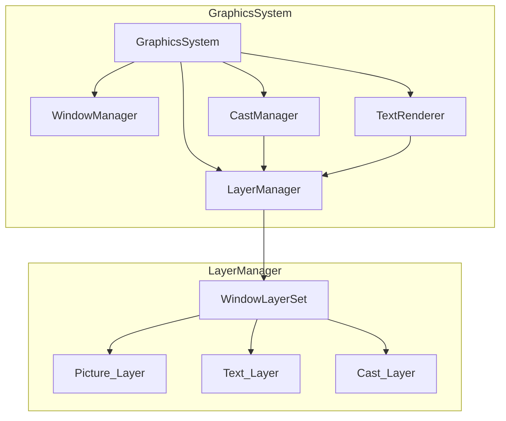

# 設計ドキュメント: レイヤーシステム再設計 (Layer System Redesign)

## 概要

このドキュメントは、FILLYエミュレータのグラフィックスレイヤーシステムの再設計を定義します。現在の実装では、レイヤーがPictureIDで管理されていますが、FILLYの設計ではレイヤーはWindowに属するべきです。この再設計により、レイヤーの所属関係を正しく管理し、描画の不具合を解消します。

### 現在の問題点

```
現在の実装:
┌─────────────────────────────────────────────────────────────┐
│ LayerManager                                                 │
│   layers: map[PictureID]*PictureLayerSet                    │
│                                                              │
│   createCastLayer: cast.WinID で登録 ← 正しい               │
│   drawLayersForWindow: win.PicID で検索 ← 間違い            │
└─────────────────────────────────────────────────────────────┘
```

この不一致により、レイヤーが見つからないか、間違ったウィンドウに関連付けられます。

### 新しい設計

```
新しい実装:
┌─────────────────────────────────────────────────────────────┐
│ LayerManager                                                 │
│   windowLayers: map[WindowID]*WindowLayerSet                │
│                                                              │
│   createCastLayer: winID で登録                             │
│   drawLayersForWindow: win.ID で検索                        │
└─────────────────────────────────────────────────────────────┘
```

## アーキテクチャ

### レイヤーモデル

```
Window
├── Background Color (fill)
└── Layer Stack (Z-order)
    ├── Picture_Layer (MovePicで作成、焼き付け可能)
    ├── Text_Layer (TextWriteで作成、常に新規)
    └── Cast_Layer (PutCastで作成、スプライト動作)
```

### コンポーネント図



## コンポーネントとインターフェース

### WindowLayerSet（新規）

`PictureLayerSet`を置き換える新しい構造体。ウィンドウIDをキーとして管理します。

```go
// WindowLayerSet はウィンドウに属するレイヤーの集合
type WindowLayerSet struct {
    // ウィンドウID
    WinID int
    
    // 背景色
    BgColor color.Color
    
    // ウィンドウサイズ
    Width, Height int
    
    // レイヤースタック（Z順序でソート）
    Layers []Layer
    
    // 次のZ順序カウンター
    nextZOrder int
    
    // 合成バッファ
    CompositeBuffer *ebiten.Image
    
    // ダーティフラグ
    FullDirty bool
    DirtyRegion image.Rectangle
}
```

### LayerManager（変更）

```go
// LayerManager はレイヤーを管理する
type LayerManager struct {
    // ウィンドウIDごとのレイヤーセット（新規）
    windowLayers map[int]*WindowLayerSet
    
    // ピクチャーIDごとのレイヤー（後方互換性のために残す）
    layers map[int]*PictureLayerSet
    
    // 次のレイヤーID
    nextLayerID int
    
    // ミューテックス
    mu sync.RWMutex
}
```

**注意: picToWinMappingについて**

設計当初は`picToWinMapping`（ピクチャーIDからウィンドウIDへのマッピング）をLayerManagerに追加することを検討していましたが、以下の理由から不要と判断しました：

1. **WindowManagerが既に逆引き機能を提供**: `WindowManager.GetWinByPicID()`が実装済みで、ピクチャーIDからウィンドウIDへの逆引きが可能
2. **データの一貫性**: 同じマッピングを複数の場所で管理すると、データの同期が必要になり複雑さが増す
3. **実際の使用パターン**: `transfer.go`、`vm.go`などで`GetWinByPicID`が使用されており、正常に動作している

要件7.5「ピクチャーIDからウィンドウIDへの逆引きをサポートする」は、WindowManagerの`GetWinByPicID`メソッドで満たされています。

### Picture_Layer（新規）

MovePicで作成されるレイヤー。焼き付け（baking）が可能です。

```go
// PictureLayer はMovePicで作成されるレイヤー
type PictureLayer struct {
    BaseLayer
    
    // ウィンドウサイズの透明画像
    image *ebiten.Image
    
    // 焼き付け可能フラグ
    bakeable bool
}

// Bake は画像をこのレイヤーに焼き付ける
func (l *PictureLayer) Bake(src *ebiten.Image, destX, destY int)

// IsBakeable は焼き付け可能かどうかを返す
func (l *PictureLayer) IsBakeable() bool
```

### Text_Layer（変更）

TextWriteで作成されるレイヤー。常に新規作成されます。

```go
// TextLayerEntry はテキストレイヤーのエントリ
// 既存の実装を維持しつつ、WindowLayerSetに追加
type TextLayerEntry struct {
    BaseLayer
    textLayer *TextLayer
}
```

### Cast_Layer（変更）

PutCastで作成されるスプライトレイヤー。

```go
// CastLayer はキャストを保持するレイヤー
// 既存の実装を維持しつつ、WindowLayerSetに追加
type CastLayer struct {
    BaseLayer
    // ... 既存のフィールド
}
```

### Layer インターフェース（変更）

```go
// Layer は描画レイヤーの基本インターフェース
type Layer interface {
    GetID() int
    GetBounds() image.Rectangle
    GetZOrder() int
    SetZOrder(int)
    IsVisible() bool
    IsOpaque() bool
    IsDirty() bool
    SetDirty(bool)
    GetImage() *ebiten.Image
    Invalidate()
    
    // 新規: レイヤータイプを識別
    GetLayerType() LayerType
}

// LayerType はレイヤーの種類を表す
type LayerType int

const (
    LayerTypePicture LayerType = iota
    LayerTypeText
    LayerTypeCast
)
```

## データモデル

### レイヤー所属関係

```
┌─────────────────────────────────────────────────────────────┐
│ Window (ID: 0)                                               │
│   ├── BgColor: RGB(0, 0, 128)                               │
│   └── Layers:                                                │
│       ├── Picture_Layer (Z=1) ← MovePic結果                 │
│       ├── Cast_Layer (Z=2) ← PutCast結果                    │
│       ├── Picture_Layer (Z=3) ← MovePic結果（新規作成）     │
│       └── Text_Layer (Z=4) ← TextWrite結果                  │
└─────────────────────────────────────────────────────────────┘

┌─────────────────────────────────────────────────────────────┐
│ Window (ID: 1)                                               │
│   ├── BgColor: RGB(255, 255, 255)                           │
│   └── Layers:                                                │
│       ├── Cast_Layer (Z=1)                                   │
│       └── Text_Layer (Z=2)                                   │
└─────────────────────────────────────────────────────────────┘
```

### MovePicの焼き付けロジック

```
MovePic呼び出し時:
┌─────────────────────────────────────────────────────────────┐
│ 1. 最上位レイヤーを確認                                      │
│                                                              │
│ 2. IF 最上位がPicture_Layer:                                │
│       → そのレイヤーに焼き付け                              │
│                                                              │
│ 3. ELSE IF 最上位がCast/Text_Layer:                         │
│       → 新しいPicture_Layer（ウィンドウサイズ、透明）を作成 │
│       → 新しいレイヤーに焼き付け                            │
│                                                              │
│ 4. ELSE (レイヤースタックが空):                             │
│       → 新しいPicture_Layerを作成                           │
│       → 新しいレイヤーに焼き付け                            │
└─────────────────────────────────────────────────────────────┘
```

## 正しさの性質

*正しさの性質とは、システムのすべての有効な実行において真であるべき特性や振る舞いです。これらは人間が読める仕様と機械で検証可能な正しさの保証の橋渡しとなります。*

### Property 1: レイヤーのWindowID管理

*任意の*ウィンドウIDとレイヤーに対して、そのウィンドウIDでレイヤーを登録した場合、同じウィンドウIDで検索するとそのレイヤーが見つかる。

**Validates: Requirements 1.1, 1.5**

### Property 2: ウィンドウ開閉時のレイヤーセット管理

*任意の*ウィンドウに対して、ウィンドウを開いた後はWindowLayerSetが存在し、ウィンドウを閉じた後はそのウィンドウに属するすべてのレイヤーが削除される。

**Validates: Requirements 1.2, 1.3**

### Property 3: レイヤータイプの識別

*任意の*レイヤーに対して、GetLayerType()は正しいレイヤータイプ（Picture、Text、Cast）を返す。

**Validates: Requirements 2.4**

### Property 4: MovePicの焼き付けロジック

*任意の*ウィンドウとMovePic呼び出しに対して:
- 最上位がPicture_Layerの場合、レイヤー数は増えない
- 最上位がCast/Text_Layerまたはスタックが空の場合、新しいPicture_Layerが作成される
- 新しいPicture_Layerはウィンドウサイズで透明に初期化される
- 焼き付け後、対象レイヤーはダーティとしてマークされる

**Validates: Requirements 3.2, 3.3, 3.4, 3.5, 3.6**

### Property 5: Text_Layerの新規作成

*任意の*TextWrite呼び出しに対して、常に新しいText_Layerが作成され、既存のレイヤーは再利用されない。

**Validates: Requirements 2.6, 5.1, 5.2**

### Property 6: Cast_Layerのスプライト動作

*任意の*Cast_Layerに対して:
- PutCastで新しいCast_Layerが作成される
- MoveCastで位置が更新される（Z順序は変わらない）
- DelCastでCast_Layerが削除される
- 移動時に古い位置と新しい位置がダーティ領域としてマークされる

**Validates: Requirements 4.1, 4.2, 4.3, 4.6**

### Property 7: Z順序の管理

*任意の*レイヤー追加操作に対して:
- 新しいレイヤーには現在のZ順序カウンターが割り当てられる
- カウンターは操作ごとに増加する
- すべてのレイヤータイプで共通のカウンターが使用される
- レイヤーはZ順序（小さい順）でソートされる

**Validates: Requirements 6.2, 6.3, 6.4**

### Property 8: レイヤーのウィンドウ登録

*任意の*レイヤー作成操作（PutCast、MovePic、TextWrite）に対して:
- レイヤーは正しいウィンドウIDで登録される
- ピクチャーIDからウィンドウIDへの逆引きが正しく動作する

**Validates: Requirements 7.1, 7.2, 7.3, 7.5**

### Property 9: ダーティフラグの動作

*任意の*レイヤー変更操作に対して:
- 位置変更時にダーティフラグが設定される
- 内容変更時にダーティフラグが設定される
- 合成処理完了後にダーティフラグがクリアされる

**Validates: Requirements 9.1, 9.2**

### Property 10: エラーハンドリング

*任意の*無効なID（存在しないウィンドウID、レイヤーID）に対して:
- エラーがログに記録される
- 処理がスキップされる（クラッシュしない）
- 実行が継続される

**Validates: Requirements 10.1, 10.2, 10.3, 10.4**

## エラーハンドリング

### エラーケース

| エラー | 処理 |
|--------|------|
| 存在しないウィンドウID | ログに記録し、処理をスキップ |
| 存在しないレイヤーID | ログに記録し、処理をスキップ |
| レイヤー作成失敗 | ログに記録し、nilを返す |
| ピクチャーID逆引き失敗 | ログに記録し、処理をスキップ |

### エラーメッセージ形式

```
[関数名]: [エラー内容], windowID=[ID], layerID=[ID]
```

例:
```
drawLayersForWindow: window layer set not found, windowID=5
createCastLayer: failed to create layer, windowID=3, castID=10
```

## テスト戦略

### 単体テスト

単体テストは特定の例とエッジケースを検証します。

1. **WindowLayerSetの作成と削除**
   - ウィンドウを開いた後、WindowLayerSetが存在することを確認
   - ウィンドウを閉じた後、WindowLayerSetが削除されることを確認

2. **レイヤータイプの識別**
   - 各レイヤータイプがGetLayerType()で正しく識別されることを確認

3. **焼き付けロジックのエッジケース**
   - 空のスタックでのMovePic
   - Picture_Layerが最上位でのMovePic
   - Cast_Layerが最上位でのMovePic

4. **エラーハンドリング**
   - 存在しないウィンドウIDでの操作
   - 存在しないレイヤーIDでの操作

### プロパティベーステスト

プロパティベーステストは普遍的な性質を多数の生成された入力で検証します。

**テストライブラリ**: `testing/quick` または `github.com/leanovate/gopter`

**設定**: 各プロパティテストは最低100回の反復を実行

1. **Property 1: レイヤーのWindowID管理**
   - ランダムなウィンドウIDとレイヤーを生成
   - 登録と検索が一致することを確認
   - **Tag**: Feature: layer-system-redesign, Property 1: レイヤーのWindowID管理

2. **Property 2: ウィンドウ開閉時のレイヤーセット管理**
   - ランダムなウィンドウ操作シーケンスを生成
   - 開閉後の状態が正しいことを確認
   - **Tag**: Feature: layer-system-redesign, Property 2: ウィンドウ開閉時のレイヤーセット管理

3. **Property 4: MovePicの焼き付けロジック**
   - ランダムな初期状態とMovePic呼び出しを生成
   - 焼き付けロジックが正しく動作することを確認
   - **Tag**: Feature: layer-system-redesign, Property 4: MovePicの焼き付けロジック

4. **Property 7: Z順序の管理**
   - ランダムなレイヤー追加シーケンスを生成
   - Z順序が正しく増加することを確認
   - **Tag**: Feature: layer-system-redesign, Property 7: Z順序の管理

5. **Property 8: レイヤーのウィンドウ登録**
   - ランダムなレイヤー作成操作を生成
   - 正しいウィンドウに登録されることを確認
   - **Tag**: Feature: layer-system-redesign, Property 8: レイヤーのウィンドウ登録

### 統合テスト

1. **既存スクリプトの動作確認**
   - サンプルFILLYタイトルを実行し、描画結果を確認
   - 回帰がないことを確認

2. **複合操作のテスト**
   - MovePic → PutCast → TextWrite の順序で操作
   - 正しいZ順序で描画されることを確認

