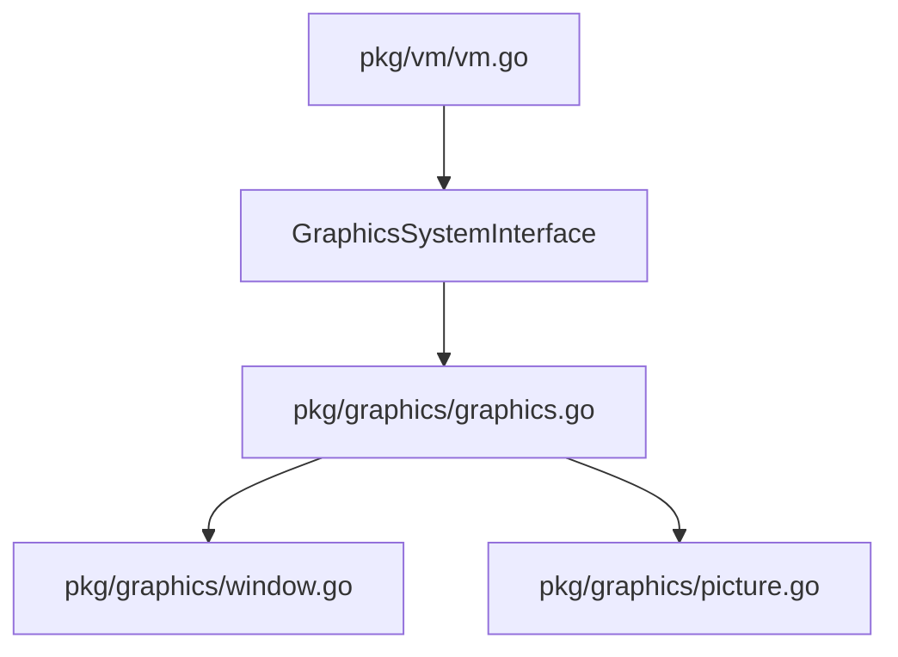

# 設計ドキュメント

## 概要

ROBOTサンプル実行時に発生するエラーを修正するため、以下の3つの組み込み関数を実装・修正する：

1. **StrPrint** - printf形式の文字列フォーマット関数
2. **CreatePic 3引数パターン** - ソースピクチャーを参照して指定サイズで新規作成
3. **CapTitle 1引数パターン** - 全ての仮想ウィンドウのタイトルを一括設定

## アーキテクチャ

### 変更対象ファイル

```
pkg/vm/vm.go                    - StrPrint, CreatePic, CapTitle の組み込み関数登録
pkg/graphics/graphics.go        - GraphicsSystemInterface の拡張
pkg/graphics/window.go          - CapTitleAll メソッドの追加
pkg/graphics/picture.go         - CreatePicWithSize メソッドの追加
```

### 依存関係



## コンポーネントとインターフェース

### 1. StrPrint 関数

#### 実装場所
`pkg/vm/vm.go` の `registerDefaultBuiltins()` メソッド内

#### 関数シグネチャ
```go
// StrPrint はprintf形式の文字列フォーマットを行う
// format: フォーマット文字列（%ld, %lx, %s, %03d等をサポート）
// args: フォーマット引数
// 戻り値: フォーマットされた文字列
func strPrint(format string, args ...any) string
```

#### 処理フロー
1. フォーマット文字列内の `%ld` を `%d` に変換
2. フォーマット文字列内の `%lx` を `%x` に変換
3. エスケープシーケンス（`\n`, `\t`, `\r`）を実際の制御文字に変換
4. `fmt.Sprintf` を使用してフォーマット実行
5. 結果の文字列を返す

### 2. CreatePic 3引数パターン

#### GraphicsSystemInterface の拡張
```go
// GraphicsSystemInterface に追加
CreatePicWithSize(srcID, width, height int) (int, error)
```

#### PictureManager への追加メソッド
```go
// CreatePicWithSize は指定されたサイズの空のピクチャーを生成する
// srcID: 参照用のソースピクチャーID（存在確認のみ）
// width, height: 新しいピクチャーのサイズ
// 戻り値: 新しいピクチャーID、エラー
func (pm *PictureManager) CreatePicWithSize(srcID, width, height int) (int, error)
```

#### 処理フロー
1. ソースピクチャーIDの存在確認
2. 幅・高さのバリデーション（0以下はエラー）
3. 指定サイズの空のピクチャーを作成
4. 新しいピクチャーIDを返す

### 3. CapTitle 1引数パターン

#### GraphicsSystemInterface の拡張
```go
// GraphicsSystemInterface に追加
CapTitleAll(title string)
```

#### WindowManager への追加メソッド
```go
// CapTitleAll は全てのウィンドウのキャプションを設定する
// title: 設定するキャプション
func (wm *WindowManager) CapTitleAll(title string)
```

#### 処理フロー
1. 全てのウィンドウを取得
2. 各ウィンドウのキャプションを設定
3. ウィンドウが存在しない場合は何もしない（エラーなし）

## データモデル

### 既存のデータ構造（変更なし）

```go
// Picture はメモリ上の画像データを表す
type Picture struct {
    ID            int
    Image         *ebiten.Image
    OriginalImage *image.RGBA
    Width         int
    Height        int
}

// Window は仮想ウィンドウを表す
type Window struct {
    ID      int
    PicID   int
    X, Y    int
    Width   int
    Height  int
    Caption string
    // ... その他のフィールド
}
```

## 正確性プロパティ

*正確性プロパティとは、システムの全ての有効な実行において成り立つべき特性や振る舞いを形式的に記述したものです。プロパティは人間が読める仕様と機械で検証可能な正確性保証の橋渡しをします。*

### Property 1: StrPrint フォーマット変換の正確性

*任意の* フォーマット文字列と引数の組み合わせに対して、StrPrint は FILLY のフォーマット指定子（%ld, %lx）を Go 言語の対応する指定子（%d, %x）に変換し、fmt.Sprintf と同等の結果を返す。

**Validates: Requirements 1.1, 1.2, 1.3, 1.4, 1.5**

### Property 2: CreatePic 3引数パターンのサイズと内容

*任意の* 有効なソースピクチャーIDと正の幅・高さに対して、CreatePic(srcID, width, height) は指定されたサイズの空のピクチャーを作成し、そのピクチャーの幅と高さは指定された値と一致する。

**Validates: Requirements 2.1, 2.2**

### Property 3: CapTitle 1引数パターンで全ウィンドウ更新

*任意の* ウィンドウ集合とタイトル文字列に対して、CapTitle(title) を呼び出した後、全てのウィンドウのキャプションが指定されたタイトルと一致する。

**Validates: Requirements 3.1**

### Property 4: CapTitle 2引数パターンで特定ウィンドウのみ更新

*任意の* ウィンドウ集合、ウィンドウID、タイトル文字列に対して、CapTitle(winID, title) を呼び出した後、指定されたウィンドウのキャプションのみが更新され、他のウィンドウのキャプションは変更されない。

**Validates: Requirements 3.3**

## エラーハンドリング

### StrPrint
- フォーマット指定子より少ない引数: Go の `fmt.Sprintf` の動作に従う（`%!d(MISSING)` 等）
- フォーマット指定子より多い引数: 余分な引数は無視される

### CreatePic 3引数パターン
- 存在しないソースピクチャーID: エラーを返す（`-1` とエラーメッセージ）
- 0以下の幅または高さ: エラーを返す

### CapTitle
- 存在しないウィンドウID（2引数パターン）: エラーを発生させずに正常終了
- ウィンドウが存在しない（1引数パターン）: エラーを発生させずに正常終了

## テスト戦略

### ユニットテスト

1. **StrPrint テスト**
   - 各フォーマット指定子（%ld, %lx, %s, %03d）の動作確認
   - エスケープシーケンスの変換確認
   - 引数不足・過剰時の動作確認

2. **CreatePic 3引数パターン テスト**
   - 正常系: 有効なソースID、幅、高さでの作成
   - 異常系: 存在しないソースID、不正なサイズ

3. **CapTitle テスト**
   - 1引数パターン: 全ウィンドウ更新の確認
   - 2引数パターン: 特定ウィンドウのみ更新の確認
   - エッジケース: ウィンドウなし、存在しないID

### プロパティベーステスト

プロパティベーステストには `testing/quick` パッケージを使用する。各テストは最低100回のイテレーションを実行する。

1. **Property 1 テスト**: StrPrint フォーマット変換
   - ランダムな整数値と文字列でフォーマット結果を検証
   - **Feature: missing-builtin-functions, Property 1: StrPrint format conversion correctness**

2. **Property 2 テスト**: CreatePic 3引数パターン
   - ランダムなサイズでピクチャー作成を検証
   - **Feature: missing-builtin-functions, Property 2: CreatePic size and content**

3. **Property 3 テスト**: CapTitle 1引数パターン
   - ランダムな数のウィンドウで全更新を検証
   - **Feature: missing-builtin-functions, Property 3: CapTitle all windows update**

4. **Property 4 テスト**: CapTitle 2引数パターン
   - ランダムなウィンドウ集合で特定ウィンドウのみ更新を検証
   - **Feature: missing-builtin-functions, Property 4: CapTitle specific window update**
