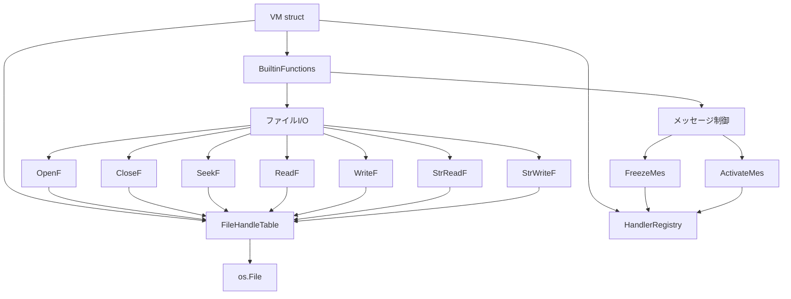

# 設計書: 必須ビルトイン関数の実装

## 概要

FILLY言語インタプリタ（son-et）に必須未実装ビルトイン関数9個を追加する。メッセージ制御（FreezeMes, ActivateMes）は既存のEventHandler.Activeフラグを操作するだけの軽量な実装となる。ファイルI/O（OpenF, CloseF, SeekF, ReadF, WriteF, StrReadF, StrWriteF）はVMに新しいFileHandleTableを導入し、整数ハンドルベースのファイル操作を提供する。

## アーキテクチャ

既存のVMアーキテクチャに2つの変更を加える:

1. `builtins_system.go` にFreezeMes/ActivateMesを追加（既存パターンに従う）
2. 新規ファイル `builtins_fileio.go` にファイルI/O関数群を追加し、`FileHandleTable` をVMに組み込む



## コンポーネントとインターフェース

### メッセージ制御関数

既存の `builtins_system.go` に追加。DelMes/GetMesNoと同じパターンで `handlerRegistry.GetHandlerByNumber()` を使用する。

```go
// FreezeMes(mes_no) — ハンドラを一時停止
// handler.Active = false にするだけ。CurrentPC/WaitCounterは保持。
func FreezeMes(v *VM, args []any) (any, error)

// ActivateMes(mes_no) — ハンドラを再開
// handler.Active = true にするだけ。停止前の状態から再開。
func ActivateMes(v *VM, args []any) (any, error)
```

FreezeMesとDelMesの違い:
- DelMes: ハンドラを完全に削除（Unregister）。復元不可。
- FreezeMes: Active=falseにするだけ。ハンドラはレジストリに残り、ActivateMesで復元可能。
- FreezeMesはRemove()を呼ばない（MarkedForDeletionをtrueにしない）。

### FileHandleTable

新規構造体。VMのフィールドとして保持する。

```go
// FileHandleTable は整数ハンドル→*os.Fileのマッピングを管理する。
// ハンドルは1から始まる正の整数。
type FileHandleTable struct {
    files   map[int]*os.File
    nextID  int
    mu      sync.Mutex
}

// Open はファイルを開き、整数ハンドルを返す。
func (fht *FileHandleTable) Open(file *os.File) int

// Get はハンドルに対応するファイルを返す。
func (fht *FileHandleTable) Get(handle int) (*os.File, error)

// Close はハンドルのファイルを閉じて解放する。
func (fht *FileHandleTable) Close(handle int) error

// CloseAll は全てのファイルを閉じる。VM停止時に呼ばれる。
func (fht *FileHandleTable) CloseAll()
```

### ファイルI/O関数

新規ファイル `builtins_fileio.go` に `registerFileIOBuiltins()` メソッドとして実装。

```go
// OpenF(filename [, mode]) — ファイルを開く
// 引数1つ: 読み込み専用
// 引数2つ: modeフラグに従う
//   アクセス属性 (下位2ビット): 0=読み書き, 1=書き専用, 2=読み専用
//   新規作成フラグ: 0x1000
func OpenF(v *VM, args []any) (any, error)

// CloseF(handle) — ファイルを閉じる
func CloseF(v *VM, args []any) (any, error)

// SeekF(handle, offset, origin) — ファイルポインタ移動
// origin: 0=SEEK_SET, 1=SEEK_CUR, 2=SEEK_END
func SeekF(v *VM, args []any) (any, error)

// ReadF(handle, size) — バイナリ読み込み（1〜4バイト→リトルエンディアン整数）
func ReadF(v *VM, args []any) (any, error)

// WriteF(handle, value [, length]) — バイナリ書き込み
// 2引数: 1バイト書き込み
// 3引数: lengthバイト書き込み（リトルエンディアン）
func WriteF(v *VM, args []any) (any, error)

// StrReadF(handle) — 1行読み込み（Shift-JIS→UTF-8変換）
// EOF時は空文字列を返す
func StrReadF(v *VM, args []any) (any, error)

// StrWriteF(handle, str) — 文字列書き込み（UTF-8→Shift-JIS変換、改行なし）
func StrWriteF(v *VM, args []any) (any, error)
```

### StrReadFのバッファリング

StrReadFは行単位の読み込みを行うため、`bufio.Reader` を使用する必要がある。しかし `*os.File` を直接 `bufio.Reader` でラップすると、バッファリングによりSeekFとの整合性が崩れる。

対策: FileHandleTableのエントリを拡張し、StrReadF用のバッファリーダーを保持する。SeekF呼び出し時にバッファをリセットする。

```go
// fileEntry はファイルハンドルテーブルの1エントリ。
type fileEntry struct {
    file   *os.File
    reader *bufio.Reader  // StrReadF用。初回StrReadF呼び出し時に遅延初期化。
}
```

## データモデル

### OpenFのmodeフラグ定数

```go
const (
    // アクセス属性（下位2ビット）
    FileAccessReadWrite = 0x0000  // 読み書き
    FileAccessWriteOnly = 0x0001  // 書き専用
    FileAccessReadOnly  = 0x0002  // 読み専用
    FileAccessMask      = 0x0003  // アクセス属性マスク

    // 新規作成フラグ
    FileCreateNew       = 0x1000  // ファイルを新規作成（存在すれば切り詰め）
)
```

### SeekFのorigin定数

```go
const (
    SeekSet = 0  // ファイル先頭から
    SeekCur = 1  // 現在位置から
    SeekEnd = 2  // ファイル末尾から
)
```

これらはGoの `io.SeekStart`, `io.SeekCurrent`, `io.SeekEnd` にそのままマッピングされる。

### ReadF/WriteFのバイトオーダー

リトルエンディアン（Windows互換）。`encoding/binary.LittleEndian` を使用。

- ReadF: size=1 → `buf[0]`、size=2 → `binary.LittleEndian.Uint16(buf)`、size=4 → `binary.LittleEndian.Uint32(buf)`
- WriteF: length=1 → `buf[0] = byte(value)`、length=2 → `binary.LittleEndian.PutUint16(buf, uint16(value))`、length=4 → `binary.LittleEndian.PutUint32(buf, uint32(value))`

### Shift-JIS変換

StrReadF/StrWriteFでは `golang.org/x/text/encoding/japanese` パッケージを使用（既存のコンパイラと同じ）。

- StrReadF: `japanese.ShiftJIS.NewDecoder()` でUTF-8に変換
- StrWriteF: `japanese.ShiftJIS.NewEncoder()` でShift-JISに変換

### VMへの統合

```go
// VM struct に追加
type VM struct {
    // ... 既存フィールド ...
    fileHandleTable *FileHandleTable  // ファイルI/O用ハンドルテーブル
}

// New() で初期化
func New(opcodes []opcode.OpCode, opts ...Option) *VM {
    // ... 既存の初期化 ...
    vm.fileHandleTable = NewFileHandleTable()
    // ...
}

// registerDefaultBuiltins() に追加
func (vm *VM) registerDefaultBuiltins() {
    // ... 既存の登録 ...
    vm.registerFileIOBuiltins()
}

// Stop() またはクリーンアップ時にファイルを閉じる
```


## 正当性プロパティ

*プロパティとは、システムの全ての有効な実行において成り立つべき特性や振る舞いのことである。プロパティは人間が読める仕様と機械的に検証可能な正当性保証の橋渡しとなる。*

prework分析に基づき、以下の正当性プロパティを定義する。冗長なプロパティは統合済み。

### Property 1: FreezeMesはハンドラを無効化する

*任意の*登録済みEventHandlerに対して、FreezeMes(mes_no)を呼び出した後、そのハンドラのActiveフラグはfalseであり、イベントディスパッチ時にそのハンドラの実行はスキップされる。

**Validates: Requirements 1.1, 1.2**

### Property 2: Freeze/Activateラウンドトリップはハンドラ状態を保持する

*任意の*登録済みEventHandlerと*任意の*CurrentPC値およびWaitCounter値に対して、FreezeMesで一時停止してからActivateMesで再開した場合、ハンドラのActiveフラグはtrue、CurrentPCとWaitCounterは停止前の値と同一である。

**Validates: Requirements 1.3, 2.1, 2.2**

### Property 3: FileHandleTableのハンドル割り当て不変条件

*任意の*Open/Close操作のシーケンスに対して、FileHandleTableが返すハンドルは常に1以上の正の整数であり、同時に開いているハンドルは全て一意である。また、Closeされたハンドルは後続のOpen呼び出しで再利用される。

**Validates: Requirements 3.2, 3.3**

### Property 4: ReadF/WriteFバイナリラウンドトリップ

*任意の*整数値valueと*任意の*有効なsize（1, 2, 4）に対して、WriteF(handle, value, size)で書き込んだ後にファイルポインタを先頭に戻してReadF(handle, size)で読み込むと、書き込んだ値と同じ値が得られる（valueをsizeバイトで表現可能な範囲に制限した場合）。

**Validates: Requirements 7.1, 7.2, 7.3, 7.4, 8.1, 8.2**

### Property 5: StrWriteF/StrReadFテキストラウンドトリップ

*任意の*改行を含まないShift-JIS変換可能な文字列に対して、StrWriteF(handle, str)で書き込み、改行バイト(0x0a)をWriteFで追記し、ファイルポインタを先頭に戻してStrReadF(handle)で読み込むと、元の文字列と同じ値が得られる。

**Validates: Requirements 9.1, 9.2, 10.1, 10.2**

### Property 6: SeekFによるランダムアクセスの整合性

*任意の*バイト列が書き込まれたファイルと*任意の*有効なオフセットに対して、SeekF(handle, offset, 0)でファイルポインタを移動した後にReadF(handle, 1)で読み込むと、そのオフセット位置のバイト値が得られる。

**Validates: Requirements 6.1, 6.2**

## エラーハンドリング

### メッセージ制御関数のエラー処理

FreezeMes/ActivateMesは既存のDelMes/GetMesNoと同じパターンに従う:
- 引数不足: 警告ログを出力し、nilを返す（エラーなし）
- 存在しないハンドラ番号: 警告ログを出力し、nilを返す（エラーなし）
- 引数の型が不正: エラーログを出力し、nilを返す（エラーなし）

これはFILLYスクリプトの寛容なエラー処理方針に従う。スクリプトの実行を中断させない。

### ファイルI/O関数のエラー処理

ファイルI/O関数はより厳格なエラー処理を行う（データ破損を防ぐため）:
- 引数不足: `fmt.Errorf` でエラーを返す
- 無効なハンドル: `fmt.Errorf` でエラーを返す
- ファイルが存在しない（OpenF、新規作成フラグなし）: `fmt.Errorf` でエラーを返す
- ReadFのsize範囲外: `fmt.Errorf` でエラーを返す
- WriteFのlength範囲外: `fmt.Errorf` でエラーを返す
- I/Oエラー（読み書き失敗）: osパッケージのエラーをラップして返す

### リソースクリーンアップ

VMの停止時（Stop()またはExitTitle）に `FileHandleTable.CloseAll()` を呼び出し、開いている全てのファイルを確実に閉じる。個別のCloseエラーはログに記録するが、クリーンアップ処理は継続する。

## テスト戦略

### テストフレームワーク

- ユニットテスト: Go標準の `testing` パッケージ
- プロパティベーステスト: `github.com/leanovate/gopter`（既存の `*_property_test.go` と同じ）

### プロパティベーステスト

各プロパティテストは最低100回のイテレーションで実行する。各テストにはデザインドキュメントのプロパティ番号をコメントで参照する。

タグフォーマット: **Feature: required-builtin-functions, Property {number}: {property_text}**

テストファイル:
- `pkg/vm/builtins_message_property_test.go` — Property 1, 2
- `pkg/vm/file_handle_table_property_test.go` — Property 3
- `pkg/vm/builtins_fileio_property_test.go` — Property 4, 5, 6

### ユニットテスト

プロパティテストでカバーしきれないエッジケースと具体例をユニットテストで補完する:

- `pkg/vm/builtins_message_test.go`:
  - FreezeMes/ActivateMesの引数不足テスト
  - 存在しないハンドラ番号のテスト
  - 既にfreezeされたハンドラへのFreezeMes（冪等性）

- `pkg/vm/file_handle_table_test.go`:
  - FileHandleTableの基本操作（Open, Get, Close, CloseAll）
  - 無効なハンドルへのGet/Close
  - CloseAll後の全ハンドル無効化

- `pkg/vm/builtins_fileio_test.go`:
  - OpenFの各モード（読み込み専用、書き込み専用、読み書き、新規作成）
  - OpenFのファイル不存在エラー
  - CloseF/SeekF/ReadF/WriteF/StrReadF/StrWriteFの引数不足テスト
  - 無効なハンドルへの各操作テスト
  - ReadFのsize範囲外テスト
  - StrReadFのEOF時の空文字列返却テスト
  - StrReadFの各改行パターン（CR, LF, CRLF）テスト
  - StrWriteFの改行非付加テスト

### テスト実行

```bash
go test -timeout 30s ./pkg/vm/... -run "TestProperty|TestFreezeMes|TestActivateMes|TestFileHandleTable|TestOpenF|TestCloseF|TestSeekF|TestReadF|TestWriteF|TestStrReadF|TestStrWriteF"
```
