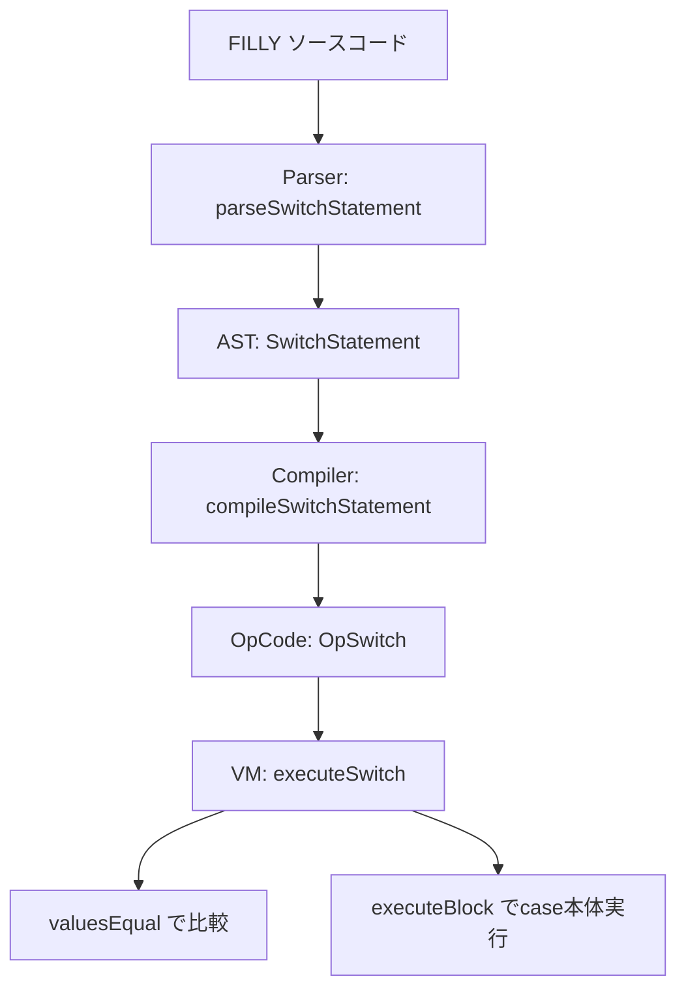

# 設計書

## 概要

FILLY言語のswitch-case文について、エッジケースのテストカバレッジを拡充し、必要に応じて実装を修正する。現在の実装はパーサー・コンパイラ・VMの3層で基本的なswitch-case/default/breakに対応しているが、いくつかのエッジケースについてテストが不足している。

## アーキテクチャ

### 現在の実装構造



### switch文の動作仕様

FILLY言語のswitch文はC言語と異なり、**フォールスルーしない**。`executeSwitch` は最初にマッチしたcaseの本体のみを実行し、即座にreturnする。

### break信号の伝播問題

```mermaid
sequenceDiagram
    participant Loop as executeFor/While
    participant Block1 as executeBlock (ループ本体)
    participant Switch as executeSwitch
    participant Block2 as executeBlock (case本体)
    participant Break as executeBreak

    Loop->>Block1: ループ本体実行
    Block1->>Switch: switch文実行
    Switch->>Block2: マッチしたcase本体実行
    Block2->>Break: break文実行
    Break-->>Block2: breakSignal
    Block2-->>Switch: breakSignal (伝播)
    Switch-->>Block1: breakSignal (キャッチせず伝播)
    Block1-->>Loop: breakSignal (伝播)
    Loop->>Loop: ループ終了 (意図しない動作の可能性)
```

現在の `executeSwitch` は `breakSignal` をキャッチしない。これにより:
- switch内のbreakがcase本体の残りの文をスキップする（正しい動作）
- しかし、breakSignalが外側のループまで伝播し、ループを終了させる（潜在的な問題）

FILLY言語ではswitch文にフォールスルーがないため、break文はcase本体の途中で処理を中断する目的でのみ使用される。breakSignalがswitch文で消費されないと、外側のループが意図せず終了する。

**修正方針**: `executeSwitch` で `breakSignal` をキャッチし、switch文の範囲で消費する。

## コンポーネントとインターフェース

### 変更対象ファイル

1. `pkg/vm/vm.go` — `executeSwitch` メソッドの修正
2. `pkg/vm/executor_test.go` — エッジケーステストの追加
3. `pkg/compiler/parser/parser_test.go` — パーサーのエッジケーステストの追加（必要に応じて）

### executeSwitch の修正

```go
func (vm *VM) executeSwitch(op opcode.OpCode) (any, error) {
    // ... 既存のcase検索ロジック ...

    if vm.valuesEqual(switchVal, caseVal) {
        caseBody, ok := caseClause["body"].([]opcode.OpCode)
        if !ok {
            return nil, fmt.Errorf("case body must be []OpCode, got %T", caseClause["body"])
        }
        result, err := vm.executeBlock(caseBody)
        if err != nil {
            return nil, err
        }
        // breakSignalをswitch文の範囲で消費する
        if _, isBreak := result.(*breakSignal); isBreak {
            return nil, nil
        }
        return result, nil
    }

    // ... defaultブロックも同様に修正 ...
}
```

## データモデル

変更なし。既存のAST構造（`SwitchStatement`, `CaseClause`）、OpCode構造（`OpSwitch`）はそのまま使用する。


## 正確性プロパティ

*プロパティとは、システムの全ての有効な実行において成立すべき特性や振る舞いのことである。プロパティは人間が読める仕様と機械的に検証可能な正確性保証の橋渡しとなる。*

### Property 1: フォールスルーなし

*For any* switch値とcase構成において、マッチしたcaseの本体のみが実行され、後続のcaseの本体は実行されない。break文の有無に関わらずこの性質が成立する。

**Validates: Requirements 1.1, 1.3**

### Property 2: ループ内breakの正確性

*For any* ループ内のswitch文において、case本体内のbreak文はswitch文のみを終了し、外側のループの実行を継続する。ループのイテレーション回数はbreak文の影響を受けない。

**Validates: Requirements 1.2**

### Property 3: case値マッチングの正確性

*For any* 整数または文字列のswitch値に対して、等しいcase値が存在する場合、そのcaseの本体が実行され、結果が正しく設定される。

**Validates: Requirements 2.1, 2.2**

### Property 4: defaultフォールバックの正確性

*For any* switch値がどのcase値とも一致しない場合、defaultブロックがあればdefaultが実行され、なければ何も実行されずswitch文が終了する。

**Validates: Requirements 2.3, 2.4**

## エラーハンドリング

- `executeSwitch` の引数不足: 既存のエラーチェック（`len(op.Args) < 2`）を維持
- case値の評価エラー: 既存のエラーハンドリングを維持
- case本体の実行エラー: `executeBlock` からのエラーを伝播（breakSignalのみキャッチ）

## テスト戦略

### ユニットテスト

以下のエッジケースについてユニットテストを追加:

- 空のcase本体（Requirements 3.1）
- ネストされたswitch文（Requirements 3.2）
- defaultの後にcaseがある場合（Requirements 3.4）
- case値が式の場合（Requirements 2.5）

### プロパティベーステスト

Go言語の `testing/quick` パッケージを使用。各プロパティテストは最低100回のイテレーションで実行。

- **Property 1**: ランダムなswitch値とcase値のリストを生成し、マッチしたcaseのみが実行されることを検証
- **Property 2**: ランダムなループ回数とswitch値を生成し、ループ内switchのbreakがループを壊さないことを検証
- **Property 3**: ランダムな整数/文字列値を生成し、正しいcaseが選択されることを検証
- **Property 4**: マッチしないswitch値を生成し、default有無に応じた動作を検証

各テストには以下の形式でタグを付与:
```
// Feature: switch-edge-cases, Property N: [property text]
```
